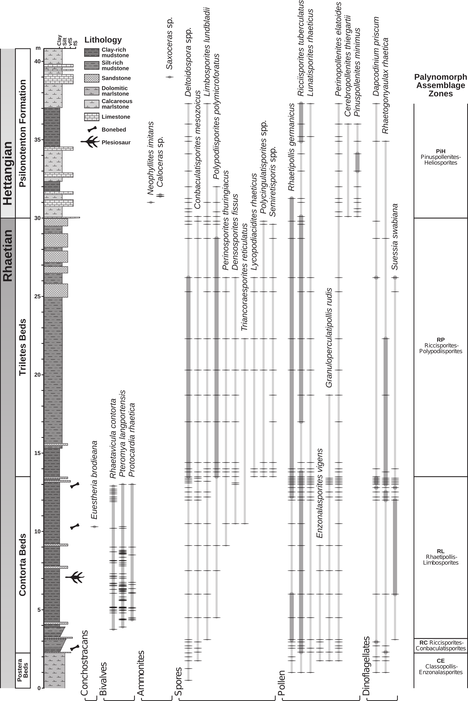

```{r setup, include=FALSE}
#-------------------------------
# global options and packages
#-------------------------------

knitr::opts_chunk$set(echo = FALSE, digits=2, message=FALSE, warning=FALSE, dpi=300) # global options for Knitr regarding printing of code chunks, warnings, digits and resolution of figures

#required packages
library(ggplot2)   # plotting
library(gridExtra) # multiplot
library(ggtern)    # package for ternary diagrams
library(broman)    # rounding of values
library(kfigr)     # cross reference hook for Rmarkdown
library(dplyr)     # dataframe restructuring
library(gtable)    # ggplot restructering

path <- ".../supplement/" # path to report

setwd(paste(path, "report", sep=""))


```


```{r}


#-------------------------------
# This is a knitr hook to enable figure and table captions
# number figures
# from http://stackoverflow.com/a/18672268/1036500
#-------------------------------

library("knitr")
tn = local({
  i = 0
  function(x) {
    i <<- i + 1
    paste("<table><caption>", 'Fig. ', i, '. ', x, "</caption><colgroup><col width='100'></col></colgroup><thead><tr class='header'></tr></thead><tbody></tbody></table><p>", sep = '')
  }
})
knit_hooks$set(fig.cap = function(before, options, envir) {
  if(!before)
    tn(options$fig.cap)
})
default_output_hook = knit_hooks$get("output")
knit_hooks$set(output = function(x, options) {
  if (is.null(options$fig.cap) == F)  
    x
  else
    default_output_hook(x,options)
})

# number tables
# from http://stackoverflow.com/a/18672268/1036500
to = local({
  i = 0
  function(x) {
    i <<- i + 1
    paste('\n\n:Table ', i, ': ', x, sep = '')
  }
})
knit_hooks$set(tab.cap = function(before, options, envir) {
  if(!before)
    to(options$tab.cap)
})
default_output_hook = knit_hooks$get("output")
knit_hooks$set(output = function(x, options) {
  if (is.null(options$tab.cap) == F)  
    x
  else
    default_output_hook(x,options)
})


```


##### Page Break

# Introduction

The Late Triassic interval is signified by dramatic faunal and floral turnovers on a backdrop of environmental and climatic change [@Mcelwain1999; @Whiteside2007; @Whiteside2010; @Schootbrugge2009; @Ruhl2011; @Blumenberg2016]. Contemporaneous intense magmatic activity, known as the Central Atlantic Magmatic Province, has been identified as a potential trigger for these perturbations [e.g. @Marzoli2018]. Although being one of the "Big Five" mass extinctions [@Raup1982], the severity and abruptness of the biodiversity depletion is contested by some authors [e.g. @Tanner2004]. Nevertheless, there is evidence of globally elevated latest Triassic extinction rates of benthic organisms [@Kiessling2007], severely disturbed reef ecosystems [@Dunhill2017], selective extinction among hypercalcifying organisms [@Honisch2012a], and a turnover of phytoplankton, marine reptiles, and temnospondyl amphibians [@Schootbrugge2007; @Wintrich2017; @Konietzko-Meier2018]. These factors altogether rank the event as a pivotal moment in Earth history, which defined the course of evolution and helped shape present-day ecosystems.

Robust stratigraphic frameworks are a necessity to resolve the complex interplay of these environmental changes and consequential biotic responses. Ammonite biozones are used as the official definition for the base of the Jurassic system [@Hillebrandt2013]. Palynostratigraphy is an alternative correlative tool, which has been successfully applied in certain basins [@Kuerschner2007; @Bonis2009]. Over the last decades, carbon isotope chemostratigraphy has increasingly gained in importance as the basis for global correlative schemes that link individual Tr--J boundary sections [@Palfy2001; @Hesselbo2002; @Guex2004; @Galli2005; @Kuerschner2007; @Ruhl2009; @Bachan2012; @DalCorso2014; @Yager2017].

Many studies have focused on pronounced negative shifts in the carbon isotope composition of organic matter, postulating a sudden marine productivity collapse, climate-driven methane hydrate dissociation and volcanism-derived CO~2~ as possible triggers for these isotopic signatures [@Ward2001; @Palfy2001; @Hesselbo2002; @Whiteside2010; @Ruhl2011; @DalCorso2014; @Yager2017]. Some authors have also focused on positive carbon isotope excursions observed in sedimentary total organic carbon (TOC) and carbonate rock [@Bachan2012; @Yager2017]. The signal-to-noise ratio is low, however, and although compound-specific C isotope analyses confirm a perturbation of the atmosphere--ocean system [@Whiteside2010; @Ruhl2011], noisy records might preclude the faithful recognition of a globally contemporaneous signal [@Lindstrom2017]. For instance, organic matter source changes might significantly contribute to stratigraphic fluctuations in TOC-based carbon isotope curves and obscure the recognition of signals forced by the exogenic carbon reservoir [@Arthur1985; @Popp1989; @Schootbrugge2008]. Moreover, high-amplitude sea level fluctuations are a prominent feature of this time interval, which might have caused condensation and sedimentation breaks [@Hallam1981; @Hallam1999; @Hesselbo2004], but could also lead to extensive reworking of land-derived sedimentary organic material [@Bachan2012].

A disproportional number of well-studied Tr--J transitional beds are located in Europe [e.g. @Jungst1928; @Morbey1975; @Lund1977; @Karle1984; @Kuerschner2007; @Bonis2009; @Bonis2010; @Heunisch2010; @Lindstrom2017; @Barth2018], hence these sites form an excellent basis to test the ubiquity of C isotope signals based on TOC. In addition, correlative schemes based on lithology, macro-fossils and palynomorph assemblages provide an independent stratigraphic framework [@Hillebrandt2013; @Lindstrom2017; @Barth2018].

Many of the European sites exhibit marked lithological changes, with a progradational unit just before the ammonite-defined system boundary that recurs at many localities [@Hallam1981; @Hallam1999; @Lindstrom2017]. Total organic carbon of this lithological unit is accompanied by pronounced higher carbon isotope values in comparison to the bracketing strata. We deem it necessary to better resolve the organic matter sources of the transitional beds by improving our understanding of the sedimentological and mineralogical characteristics of these lithological units. By not only studying the so-called Event Beds [@Lindstrom2017] but also the bracketing intervals, placed within a wider geographic context, we try to identify general patterns in the stratigraphic record of the TOC-based C isotopes and to separate the effects of variations in local organic matter sources and global contributions of the exogenic carbon pool.


# Geological setting

## Palaeogeography of the Central European Basin and the western Tethys shelf seas

During the Late Triassic the area that comprises the modern contours of Europe was situated at temperate latitudes (between 30°N and 50°N) and was largely covered by shallow epicontinental seas from which few scattered continental blocks, such as the Rhenish Massif, Bohemian Massif and the Fennoscandian High emerged (`r figr("FigGeo", TRUE, type="Fig")`). 


```{r FigGeo, anchor="figure", fig.cap = "Geographic reconstruction of the Central European Basin and western Tethys shelf seas: 1-Kuhjoch, 2-Hochalplgraben, 3-Kendlbachgraben, 4-Tiefengraben, 5-Restentalgraben, 6-Mingolsheim, 7-Mariental, 8-Schandelah, 9-Bonenburg and 10-Stenlille." }

#-------------------------------
# this is an externally loaded figure (Fig 1)
#-------------------------------

knitr::include_graphics('figures/Fig1.tif')


```

Important depocenters of these shallow seas were located in the Central European Basin (CEB) and the western Tethyan shelf seas, which appear to have been structurally connected [@Bachmann2008; @Barth2018]. Well-studied Tr--J sections of the western Tethyan shelf are mainly known from the intracratonic Kössen and Eiberg Basins. One of these sites, the Kuhjoch section, has been assigned as the Global Stratotype Section and Point (GSSP) for the base of the Jurassic System [@Hillebrandt2013]. In NW Europe, relatively larger parts of the Tr--J boundary succession are likely missing or highly condensed [@Schootbrugge2008; @Lindstrom2017].  

## General lithology of the Central European Basin and the western Tethys shelf seas

A Rhaetian transgression induced deposition of shales and deltaic sandstones of the Contorta Beds along the north-western half of the CEB, replacing terrestrial lithologies. The Fennoscandian High and the Bohemian Massif are considered the main contributors of detrital sediment input [@Nielsen2003; @Bachmann2008; @Fischer2012; @Barth2018].  During the same interval, the western margin of the Tethys Ocean experienced increased siliciclastic sedimentation which reduced the areal extent of previous extensive carbonate platforms (Hauptdolomit Formation/Dachstein Formation) [@Hallam1981; @Krystyn2005; @Hillebrandt2013]. Mixed carbonate and siliciclastic sedimentation (Kössen Formation) continued in intracratonic depressions, such as the Kössen and the Eiberg Basins, which were bordered by reefs at the northern boundary and the southern seaward shelf edge (Oberrhät Limestone). Peak occurrences of marine palynomorphs indicate a Late Triassic sea level highstand in the CEB [@Hallam1999; @Lindstrom2007; @Barth2018]. In the Eiberg Basin, this interval marks a lithological change, with a distinct dark and bituminous layer, the so-called "T-Bed" [@Krystyn2005; @Ruhl2010]. 
  
A subsequent global sea level fall exposed many marine sections around the world [@Hallam1981]. However, sedimentation seems uninterrupted in deeper parts of the depocenters, and continued deposition might have been aided by concomitant subsidence [@Nielsen2003; @Krystyn2005; @Barth2018]. This change is documented as grey marly deposits of the Tiefengraben Member (Kendlbach Formation) in the Northern Calcareous Alps. In the CEB this drop in sea level has been connected with the formation of a progradational unit of organic matter-poor silt and sandstone, known as the Triletes Beds in Germany and time-equivalent units in Denmark [@Lindstrom2017]. Another conspicuous and widespread unit in the Eiberg Basin is a bright red clayey marl unit, known as the Schattwald Beds [@Lindstrom2017]. The similarities of these lithological units of the CEB and western Tethys shelf seas led the previous authors to propose a shared name for these units: the "Event Beds". 

A subsequent transgression has been linked with severe condensation and the lack of several earliest Jurassic ammonite biozones in many sections of the CEB [@Schootbrugge2008; @Lindstrom2017]. By contrast, the sections of western Tethys shelf seas document a return to grey marls of the Tiefengraben Member, which contain the oldest known psiloceratid ammonite (*Psiloceras spelae tirolicus*). Eventually, the ongoing transgression resulted in the formation of limestones of the Breitenberg Member (Kendlbach Formation) [@Hillebrandt2013]. Earliest Jurassic sediments of the CEB are generally of an open marine origin with ammonites belonging to the Planorbis biozone (Psilonotenton Formation) [e.g. @Wetzel1929; @Blind1963; @Bloos1999; @Schootbrugge2009; @Lindstrom2017].


# Materials and Methods

## Materials

The Tr–J transitional beds of the Bonenburg and Kuhjoch sections are studied for their sedimentological, palaeontological and bulk geochemical characteristics as representatives for the CEB and the western Tethys shelf seas, respectively. The Bonenburg site (51.5631$\,$°N; 9.0401$\,$°E) is an active brick quarry situated 1$\,$km NW of the village of Bonenburg (City of Warburg, Germany). Samples were taken over a 40$\,$m interval with an approximate resolution of 50$\,$cm. The Kuhjoch GSSP site (47.4839$\,$°N; 11.5306$\,$°E) is located in the western part of the Northern Calcareous Alps (NCA), 25$\,$km NNE of Innsbruck and 5 km ENE of the village of Hinterriss (Austria). This section (~24$\,$m) was sampled over an interval of 9$\,$m at 20$\,$cm intervals [@Bonis2010; @Hillebrandt2013]. In the lab, the surface of the rock samples was removed to prevent contamination with modern organic material, after which the material was ground manually with agate mortar and pestle, except for a few limestones which were ground with a mechanic agate mill.  


## Bulk rock biogeochemical analysis

In order to remove the carbonate content, the samples were treated with 2M HCl and left over night to react at room temperature. This procedure was repeated until no further reaction was observed. The residues were repeatedly washed with MilliQ water^TM^ and dried at 40$\,$°C. The de-carbonated samples were analyzed for total organic carbon (TOC) content and associated carbon isotopic composition with a THERMOFlash AS 11121 elemental analyzer linked to a THERMO/Finnigan conflo interface (at the Museum für Naturkunde, Berlin).  A separate analysis on untreated sample material was carried out to obtain total nitrogen (TN) composition. The analytical precision was monitored by a lab-internal standard (peptone) and yielded relative standard deviations (RSDs) of 3$\,$% for the C and N concentration and 0.05$\,$‰ (2SD) for C isotope composition. All carbon isotope measurements are reported in standard delta notation relative to VPDB. Obtained TOC values of de-carbonated substrates were corrected for weight-loss during acid digestion. These analyses were complemented with published carbon isotope data of the Mingolsheim core [@Quan2008], Stenlille core [@Lindstrom2015], Mariental core [@Schootbrugge2013], Schandelah core [@Schootbrugge2018] and several outcrops of the NCA (Kuhjoch, Restentalgraben, Kendlbachgraben, Hochalplgraben, and Tiefengraben) [@Ruhl2009]. In addition, TOC, TN and percent carbonate mineral data for Kuhjoch were taken from @Ruhl2010. 


Whole rock element analyses have been performed at the Museum für Naturkunde Berlin with a Bruker AXS S8 TIGER on fused samples for major elements. The production of the fused pellets required 0.6$\,$g of ground sample, which had been dried at 105$\,$°C, mixed with 3.6$\,$g of di-lithiumtetraborate together with 0.5 to 20$\,$g of ammoniumnitrate (where the amount depends on the oxidation grade). Subsequently, fusion of sample pellets was performed with an OXIFLUX burner chain in Pt/AU crucibles. Precision of elemental analysis was monitored by analyzing a range of international standards, and repeated measurement of standard element concentrations yielded RSDs that are better than 5$\,$%. Element data of the Kuhjoch section are taken from @Tanner2016.    

## Microfloral analysis

Forty-four samples were collected from the Bonenburg section, 19 from the Contorta Beds and 13 from the Triletes Beds of the Exter Formation, and 12 from the Psilonotenton Formation. Palynological processing was performed according to standard laboratory protocols at the palynological laboratory of the department of Geoscience, University of Oslo, Norway. Between 5 and 15$\,$g dry sediment from each sample were crushed and a Lycopodium tablet (containing 12,542 spores on average) was added. Alternate treatments with HCl and HF were conducted to remove carbonate and silicate minerals, respectively. The residue was washed with water until pH was neutral and sieved with a 15$\,$$\mu$m mesh, treated with heavy liquid solution (ZnCl~2~) to remove the remaining inorganic residue (e.g. pyrite), and sieved again with a 15$\,$$\mu$m mesh. The organic residue was mounted on four slides per sample with Entellan®Neu. The slides are stored in the collections of the department of Geosciences at the University of Oslo. About 300 organic particles and 300 terrestrial palynomorphs were counted per sample for palynofacies and quantitative palynological analyses, respectively. The rest of each slide plus an additional slide were screened for rare species separately from the palynomorph count for qualitative analysis. Palynomorphs were classified mainly based on @Nilsson1958, @Klaus1960, @Schulz1962, @Schulz1967, @Morbey1975, @Schuurman1976, @Lund1977, and @Pedersen1980. A list of all identified morphotaxa is given in the supplement. First (FO) and last(LO) occurrences of stratigraphically important taxa were identified. This dataset was extended with data from previous palynological studies on the Kuhjoch section [@Bonis2009; @Schobben2011]

## Data processing, statistics and visualization

Data processing, statistical data treatment and visualization were performed on the open-source platform R [@R2018], and were aided by the R packages: ggplot2 [@Wickham2009], gridExtra [@Auguie2017], ggtern [@Hamilton2017], gtable [@Wickham2016], dplyr [@Wickham2018] and broman [@Broman2017]. The palynomorph assemblage zones, as suggested by qualitative analysis, were verified quantitatively by constrained clustering analysis using the CONISS-function in Tilia [@Grimm2011]. The manuscript was written as an R Markdown document, and was aided by the R packages: knitr [@Xie2014;@Xie2015;@Xie2018] and kfigr [@Koohafkan2015]. The R Markdown file as well as the biogeochemical and microfloral data are available as an online supplement.


# Chemical weathering indices

The emphasis of this study lies on the contributions of changing organic matter sources and their control on $\delta$^13^C~TOC~ fluctuations. Hence, tracing changes in the terrigenous organic carbon (OC) flux over time is a prime objective, and can be forced by changes in the parent material or differential weathering intensities. The same processes would also steer stratigraphic changes in clay mineral assemblages, as thermodynamic and kinetic constraints determine the chemical composition of clay minerals formed by the weathering of crystalline rocks at Earth's surface [@Nesbitt1984]. In essence, the fundamentals of clay chemical composition can, at least in part, be traced back to the parent material, in which some minerals are susceptible to weathering, such as potash feldspar and plagioclase, whereas others are more resistant to weathering, such as quartz and Ti-bearing oxides. These differences can be traced by the selective removal of soluble elements from the parent material with a classical study of the ratios of elements that are presumed to be soluble and mobile against immobile elements. Immobile elements form hydrolyzates and have a large ionic radius, increasing their tendency to be adsorbed on clay minerals [@Buggle2011]. Although processes like authigenic clay mineral formation (potentially aided by bacteria), cation adsorption and sorting effects [@Konhauser2002; @Michalopoulos2004] can skew these generalized assumptions, first-order trends in these element distributions might still be entrained in the chemistry of marine sedimentary rock. For instance, authigenic clay minerals only compose a small percentage of the total sediment mass in deltaic sediments of the Amazon River [@Michalopoulos2004]. Hence, bulk chemistry of the produced material will primarily be controlled by the sediment source and the weathering intensity. By presenting the molar proportions of Na~2~O, K~2~O and Al~2~O~3~ on a ternary coordinate system, we attempt to evaluate changes in the terrestrial clay mineral flux for the Tr–J boundary beds of Kuhjoch and Bonenburg. The element distributions have been corrected for carbonate content to prevent distortion of trends by differential dilution. 


# Results

## Litho- and biostratigraphy Bonenburg

The lithological subdivision and palynological zonation can be used to reconstruct an independent stratigraphic framework, enabling a comparative analysis of the supra-regional significance on facies-dependent $\delta$^13^C~TOC~ fluctuations. Biostratigraphic information is derived from macroinvertebrates (ammonites, bivalves, conchostracans) and palynomorphs (`r figr("FigStrat", TRUE, type="Fig")`). Particularly terrestrial palynomorphs, which make up at least 40 and up to 90$\,$% of the palynomorph samples (`r figr("FigBB", TRUE, type="Fig")`), exhibit distinct changes in their relative abundances across the Rhaetian and the Tr--J boundary interval at Bonenburg. In this paper, we only present the palynostratigraphically relevant data and five informal assemblage zones of terrestrial palynomorphs that can be recognised (`r figr("FigStrat", TRUE, type="Fig")`). 

```{r FigStrat, anchor="figure",  fig.cap = "Lithological column and stratigraphic ranges of key fossils from the Triassic--Jurassic transition at Bonenburg. Horizontal marks indicate the presence of a taxon in a sample. In palynomorph taxon ranges, dark grey segments indicate that the relative abundance of a taxon is higher than 5% of the terrestrial assemblage (pollen and spores) or the aquatic assemblage (dinoflagellates) respectively. Note variable spacing of analysed samples for invertebrates and palynomorphs."}

#-------------------------------
# this is an externally loaded figure (Fig 2)
#-------------------------------




```


**Contorta Beds**: Thin-bedded to massive mudstones dominate the Contorta Beds. In the basal part of the unit, mudstones and very fine to fine-grained sandstones form coarsening-upward successions. Beds of heterolithic mudstone and sandstone with trace fossils occur sporadically in the middle and upper part of the unit. Shell pavements of marine bivalves and inarticulate brachiopods, bonebeds, and carbonate concretions are intercalated at irregular intervals (`r figr("FigStrat", TRUE, type="Fig")`). The mudstones contain pyrite and gypsum throughout, whereas dolomite is largely restricted to the middle and upper part. A shift from dark grey to reddish and brownish sediment colors indicates the contact of the Contorta Beds to the Triletes Beds. Biostratigraphically relevant macroinvertebrates of the Contorta Beds include common occurrences of the Rhaetian bivalve *Rhaetavicula contorta* which is the only macrofossil that can be utilized to correlate the Contorta Beds of the CEB with sequences from the western Tethys [@Golebiowski1990]. Two other bivalves, *Protocardia rhaetica* and *Pteromya langportensis*, are shared with coeval Rhaetian deposits of the Penarth Group of Great Britain [@Ivimey1999; @Mander2008] while *P. rhaetica* is also known from Rhaetian deposits of Winterswijk in the Netherlands [@Klompmaker2010]. 

The Contorta Beds harbor three bonebeds (`r figr("FigStrat", TRUE, type="Fig")`), labelled bonebed 1 to 3 [@Sander2016; @Wintrich2017]. Bonebed 2, the main bonebed, which is subdivided into two layers, bonebed 2a and bonebed 2b, contains a typically Rhaetian vertebrate fauna composed of taxa also known from the Bristol Channel area of SW England [@Storrs1994; @Korneisel2015; @Mears2016; @Sander2016; @Wintrich2017]. Stratigraphically informative are the chondrichthyan teeth *Hybodus cloacinus*, *Lissodus minimus*, and *Rhomphaiodon minor* and the reptile *Pachystropheus rhaeticus* [@Sander2016; @Wintrich2017]. In addition, bonebed 2 has produced numerous isolated plesiosaur vertebrae [@Sander2016; @Wintrich2017] and very large shastasaurid ichthyosaur vertebrae typical of the Rhaetian [@Fischer2014a; @Lomax2018]. Finally, temnospondyl amphibian remains, including the youngest well-dated non-brachiopoid remains, have been found, suggesting a strong influence of the end-Triassic extinction event on temnospondyl amphibians [@Konietzko-Meier2018]. Three meters below bonebed 2, the only known Triassic plesiosaur skeleton that unequivocally proves that several lineages of plesiosaurs crossed the Tr--J boundary was recovered [@Wintrich2017].

Immediately below bonebed 2, the chonchostracan *Euestheria brodieana* occurs in several tightly spaced monospecific layers, indicative of the upper Rhaetian *Euestheria brodieana* Zone [@Kozur2010]. Palynologically, the lowermost part of the Contorta Beds (2.2--2.9$\,$m) represents the *Ricciisporites*-*Conbaculatisporites* Assemblage Zone (RC-Zone; `r figr("FigStrat", TRUE, type="Fig")`),  with the eponymous taxa accompanied by *Classopollis* spp., *Rhaetipollis germanicus* and *Ovalipollis* with the latter three dominating the assemblage. The remainder of the Contorta Beds (2.9--13.5$\,$m) is assigned to the *Rhaetipollis*-*Limbosporites* Assemblage Zone (RL-Zone; `r figr("FigStrat", TRUE, type="Fig")`) which is dominated by the eponymous taxa and other pollen such as *Ovalipollis* spp. and *Classopollis* spp. Within the RL-Zone morphotaxa richness increases to 74 taxa because a number of spores – especially the stratigraphically important *Densosporites fissus*, *Perinosporites thuringiacus*, and *Triancoraesporites reticulatus* – have their FOs. Reversely pollen taxa richness decreases and *Granuloperculatisporites rudis* is virtually absent from 9$\,$m up-section with its highest, but only singular, occurrence at 19$\,$m. Of particular stratigraphic importance is the LO of *Limbosporites lundbladii* at the base of this zone.

**Triletes Beds (Event Beds)**: The lower part of the Triletes Beds consists of massive or wavy bedded mudstones and thin sandstones. In the upper part, very fine to fine-grained wavy bedded, ripple cross-bedded and occasionally small-scale cross-bedded sandstones become dominant. Dolomite is present in the lower part of the unit whereas the middle and upper part is calcareous. The biostratigraphic classification of the Triletes Beds is exclusively based on palynomorphs, since macrofossils are absent, except for very few unidentifiable plant remains. The Triletes Beds (13.5--30.0$\,$m) represent the *Ricciisporites*-*Polypodiisporites* Assemblage Zone (RP-Zone; `r figr("FigStrat", TRUE, type="Fig")`). With 110 identified taxa, this assemblage zone contains the greatest taxonomic richness and the best preserved palynomorphs within the section. The zone is dominated by spores and characterized by abundant occurrences of *Polypodiisporites polymicroforatus* and *Riccisporites tuberculatus*. The latter continuously makes up 10--40$\,$% of the terrestrial assemblage while all other pollen, except *Lunatisporites rhaeticus* and *Perinopollenites elatoides*, occur sporadically only. The spore *P. polymicroforatus* makes up 5--20$\,$% of the zone and is joined by a diverse spore assemblage. At the beginning of the last quarter of the Triletes Beds (around 26$\,$m) many palynomorphs have their LOs (e.g. *Densosporites fissus*, *Triancoraesporites reticulatus*, *Perinosporites thuringiacus*, *Lycopodiacidites rhaeticus*), or decline in abundance (*Deltoidospora* spp. and *Concavisporites* spp.). Of biostratigraphic importance is the FO of *Semiretisporis* spp. and *Polycingulatisporites* spp. at the base and their LO at the top of the RP-Zone as well as the LOs of *Densosporites fissus*, *Triancoraesporites reticulatus*, *Perinosporites thuringiacus*, *Lycopodiacidites rhaeticus* at 26$\,$m. Furthermore, palynofacies analyses show a distinct increase in the fraction of wood fragments in this unit.

**Psilonotenton Formation**: The Triletes Beds are unconformably overlain by an oyster-rich coquinoid limestone bed that belongs to the Psilonotenton Formation. The Tr--J boundary is placed at the base of this erosive oyster shell bed at 30$\,$m, based on ammonoid biostratigraphy and palynoflora (see below). The Psilonotenton Formation consists predominantly of wavy to horizontally bedded marl- and mudstones with only minor limestones and contains marine bivalves and ammonites. The latter allow for a biostratigraphical subdivision of the succession (see discussion for ammonoid zonation and correlations; Section 7.1). Three ammonoid-bearing levels are identified: (1) A single specimen of *Neophyllites imitatum* from the limestone bed at 31$\,$m suggests an attribution of the bed to the second biohorizon of the British standard zonation (Page 2002), indicating the lower part of the Planorbis Chronozone. (2) Crushed specimens of *Caloceras* sp. from the limestone bed at 31.5$\,$m indicate a higher position in the Planorbis Chronozone (*Johnstoni* Subchronozone). (3) A single specimen of *Saxoceras* sp. from the limestone bed at 39$\,$m allows attribution to the upper part of the *Liassicus* Chronozone (*Laqueus* Subchronozone). This Hettangian part of the section is further characterized palynologically by a dominance of pollen, overall low taxonomic richness and generally poor preservation. *Heliosporites reissingeri* and *Deltoidospora*/*Concavisporites* spp. are the most common spores in this interval. This part of the section is assigned to the *Pinuspollenites*-*Heliosporites* Assemblage Zone (PiH-Zone; `r figr("FigStrat", TRUE, type="Fig")`).  The previously abundant *Ricciisporites tuberculatus* is substituted by *Classopollis* spp. which markedly increased in abundance from 0--1$\,$% to 36--70$\,$% in the Hettangian part of the section. The lowest part of the PiH-Zone still contains typical elements from the previous zone such as the sporadically occurring *Limbosporites lundbladii* and *Polypodiisporites polymicroforatus*. *Ricciisporites tuberculatus* is still common in the lowermost quantitative Hettangian samples, but strongly decreases in abundance thereafter. The uppermost part of the palynologically studied section is distinguished by the abundant reoccurrence of *Ricciisporites tuberculatus* and scattered occurrences of spores and pollen that were common in the RP Assemblage Zone. Of stratigraphic importance is the FO of *Cerebropollenites thiergartii* and *Pinuspollenites minimus* at the base of the Psilonotenton Formation.


## Litho- and biostratigraphy Kuhjoch

The lithostratigraphy and palynostratigraphy of the Kuhjoch Tr--J GSSP has been intensively studied [e.g. @Bonis2009; @Hillebrandt2013], and we limit our discussion to the most salient points required to enable a correlation. This correlative scheme differs from the official stratigraphic definitions (Section 2.2 and `r figr("FigKuh", TRUE, type="Fig")`) in order to test the facies-dependence of the TOC-carbon isotope composition in the Event Beds. The studied interval comprises a ~24$\,$m succession of marine limestone and marl with varying proportions of siliciclastic and carbonate material, and can be decomposed into the following units. 1) **Pre-event Beds**: the topmost 2$\,$m of the Kössen Formation (Eiberg Member), overlain by a dark bituminous layer, with abundant bivalve and fish remains [the so-called “T-Bed”; @Krystyn2005; @Ruhl2010], followed by grey and yellowish-grey marls containing the last occurrences of the ammonoid *Choristoceras marshi* [@Hillebrandt2013]. 2) **Schattwald Beds (Event Beds)**: the lithology changes to a conspicuous bright red-colored fossil-poor lithology, distinctive for the occurrences of *Polypodiisporites polymicroforatus*, *Ricciisporites tuberculates* and *Deltoidospora* spp. Local tectonics resulted in a minor fault at the top part (2.16$\,$m above the base of this unit), thereby creating a small hiatus. A second outcrop towards the east (Kuhjoch East) of the main site (Kuhjoch West) was excavated, yielding a more gradual transition into the overlying unit. 3) **Post-event Beds**: transition from red to grey marls with thin silt- and sandstone layers more common up-section. At 6.3$\,$m above the top of the Kössen Formation, the ammonite *Psiloceras spelae tirolicum* appears. The first occurrences of *Cerebropollenites thiergartii* and *Ischyosporites variegatus* are used as informal stratigraphic markers for the Tr--J boundary [@Hillebrandt2013]. 


```{r}

setwd(paste(path, "data/organics", sep=""))

#========================================================================================================================================
# loading of data regarding biogeochemical characteristics of the rock samples of sites from the Central European Basin and western Thethys shelf seas
#========================================================================================================================================

# Central European Basin
Bonenburg_d13C_toc   <- read.csv("Bonenburg_d13C_toc.csv")
Stenlille_d13C_toc   <- read.csv("Stenlille_d13C_toc.csv")
Mingolsheim_d13C_toc <- read.csv("Mingolsheim_d13C_toc.csv")
Schandelah_d13C_toc  <- read.csv("Schandelah_d13C_toc.csv")
Mariental_d13C_toc   <- read.csv("Mariental_d13C_toc.csv")


# western Thethys shelf seas
Kuhjoch_d13C_toc              <- read.csv("Kuhjoch_d13C_toc.csv")
Hochalplgraben_d13C_toc       <- read.csv("Hochalplgraben_d13C_toc.csv")
Kendlbachgraben_d13C_toc      <- read.csv("Kendlbachgraben_d13C_toc.csv")
Restentalgraben_d13C_toc      <- read.csv("Restentalgraben_d13C_toc.csv")
Tiefengraben_d13C_toc         <- read.csv("Tiefengraben_d13C_toc.csv")


#-----------------------------
# extraction of relevant data
#-----------------------------

EX<-c("Height","del13Ctoc","Strat", "Section") # relevant data columns


# Central European Basin
CEurope_com  <- rbind(Bonenburg_d13C_toc[, EX],Stenlille_d13C_toc[,EX], Mingolsheim_d13C_toc[,EX], Schandelah_d13C_toc[,EX], Mariental_d13C_toc[,EX]) 

# western Thethys shelf seas
Koessen_com   <- rbind(Kuhjoch_d13C_toc[,EX], Hochalplgraben_d13C_toc[,EX], Kendlbachgraben_d13C_toc[,EX] , Restentalgraben_d13C_toc[,EX] , Tiefengraben_d13C_toc[,EX])


#========================================================================================================================================
# loading of data regarding palynology of the rock samples of Kuhjoch and Bonenburg
#========================================================================================================================================

setwd(paste(path, "data/palynomorphs", sep=""))

Bonenburg_pal <- read.csv("Bonenburg_palyno.csv") # Bonenburg
Kuhjoch_pal   <- read.csv("Kuhjoch_palyno.csv")   # Kuhjoch


#========================================================================================================================================
# loading of bulk rock element data of Kuhjoch (Tanner et al. 2016 PALEO-3)
#========================================================================================================================================

setwd(paste(path, "data/elements", sep=""))

Kuhjoch_elements<-read.csv("Kuhjoch_elements.csv") 


```


```{r}


#========================================================================================================================================
# merging of dataframes
#========================================================================================================================================

Kuhjoch <- merge(Kuhjoch_d13C_toc, Kuhjoch_elements , by="Height", all.x=TRUE)

Bonenburg <- merge(Bonenburg_d13C_toc, Bonenburg_pal, by="SampleID", all.x=TRUE)

#========================================================================================================================================
# transformations
#========================================================================================================================================

# atomic weights
Al_m <- 26.982
Na_m <- 22.99
O_m  <- 15.999
K_m  <- 39.098
Ca_m <- 40.078
C_m  <- 12.011
N_m  <- 14.007


#---------------------------------------------------------------------------------------------------------------------------------------
# conversion function for carbonate-free basis element values
#---------------------------------------------------------------------------------------------------------------------------------------

CFB<- function(element, Carb){element/(1-Carb/100)} 


#---------------------------------------------------------------------------------------------------------------------------------------
# transformations Bonenburg
#---------------------------------------------------------------------------------------------------------------------------------------


# oxide molar 
Bonenburg <- cbind(Bonenburg, 
                    Al2O3_m = CFB(Bonenburg$Al2O3...., Bonenburg$CaCO3) / (2*Al_m+3*O_m), 
                    K2O_m   = CFB(Bonenburg$K2O...., Bonenburg$CaCO3)   / (2*K_m+ O_m), 
                    Na2O_m  = CFB(Bonenburg$Na2O...., Bonenburg$CaCO3)  / (2*Na_m+O_m))
                    
# nitrogen carbonate free basis
Bonenburg <- cbind(Bonenburg, 
                    TNcfb   = CFB(Bonenburg$TN, Bonenburg$CaCO3))

# normalized potassium                   
Bonenburg <- cbind(Bonenburg, 
                    KAl     = (Bonenburg$K2O....* (2*K_m / (2*K_m+ O_m))) /(Bonenburg$Al2O3....* (2*Al_m / (2*Al_m+3*O_m))))


# molar C:N ratio                  
Bonenburg <- cbind(Bonenburg,                     
                    CN      = (Bonenburg$TOCcfb/C_m)/(Bonenburg$TNcfb/N_m)) 

# marine fraction palynomorph 
Bonenburg <-cbind(Bonenburg, 
                    MT      = ((Bonenburg$aquatic)/((Bonenburg$terrestrial)+(Bonenburg$aquatic)))) 


#---------------------------------------------------------------------------------------------------------------------------------------
# transformations Kuhjoch
#---------------------------------------------------------------------------------------------------------------------------------------

# Kuhjoch elements only
Kuhjoch_elements <- cbind(Kuhjoch_elements, 
                    Al2O3_m = CFB(Kuhjoch_elements$Al2O3,Kuhjoch_elements$CaCO3)  / (2*Al_m+3*O_m), 
                    K2O_m   = CFB(Kuhjoch_elements$K2O,Kuhjoch_elements$CaCO3)    / (2*K_m+ O_m), 
                    Na2O_m  = CFB(Kuhjoch_elements$Na2O,Kuhjoch_elements$CaCO3)   / (2*Na_m+O_m))

# carbon and nitrogen carbonate free basis
Kuhjoch <- cbind(Kuhjoch, 
                    TOCcfb  = CFB(Kuhjoch$TOC,(Kuhjoch$mineral.C * ((C_m+O_m+O_m+O_m+Ca_m)/C_m))),
                    TNcfb   = CFB(Kuhjoch$TN,(Kuhjoch$mineral.C  * ((C_m+O_m+O_m+O_m+Ca_m)/C_m))))

# normalized potassium                   
Kuhjoch <- cbind(Kuhjoch, 
                    KAl     = (Kuhjoch$K2O* (2*K_m / (2*K_m+ O_m))) /(Kuhjoch$Al2O3* (2*Al_m / (2*Al_m+3*O_m))))

# molar C:N ratio                  
Kuhjoch <- cbind(Kuhjoch,                     
                    CN      = (Kuhjoch$TOCcfb/C_m)/(Kuhjoch$TNcfb/N_m)) 

# terrestrial palynomorph fraction 
Ter <- cbind(Kuhjoch_pal[,3:77] ,Kuhjoch_pal[, 78:112])

# aquatic palynomorph fraction
Aq <- Kuhjoch_pal[,c(113:127, 130:138)]


# marine fraction palynomorph 
Kuhjoch_pal <- cbind(Kuhjoch_pal, 
                 MT = (apply(Aq, 1, sum, na.rm = TRUE) / (apply(Aq, 1, sum, na.rm = TRUE) + apply(Ter, 1, sum, na.rm = TRUE)))) 


Kuhjoch <- merge(Kuhjoch, Kuhjoch_pal, by="Height", all.x=TRUE) # merge palynomorphs with d13C


setwd(paste(path, "/report", sep=""))


```


```{r}


#========================================================================================================================================
# plotting
#========================================================================================================================================

# Parameters for basic stratigraphic and cross plots of geological data;
# formula, e.g. y~x
# data for plotting
# title of graph, default is an empty string
# points, if TRUE creates data points
# element is the chemical element in question
# phase is the sedimentary phase in which the chemical data is recorded (e.g., carbonate)
# isotope, default is FALSe, if TRUE creates an X axis with conventional isotope notion for the chemical element used
# SI.unit sets the unit for measurement of the chemical species
# dim.unit sets the uniut for the depth or height in the stratigraphic colum
# dim can be used to either plot Height or Depth on the y axis


#-------------------------
# basic stratigraphic plot
#-------------------------

basic_plot <- function(formula, data, title = "", points = TRUE, element = "", phase = "", isotope = FALSE, SI.unit = "",  dim.unit = "", dim = "", yaxis=TRUE, group = NA, legend=FALSE){
  
  require(ggplot2)
  PRED  <- all.vars(formula)[2]
  RESP  <- all.vars(formula)[1]
  
  if(is.na(group) == FALSE){
  data <- na.omit(data[order(data[, RESP]), c(PRED, RESP, group) ])}else{
  data <- na.omit(data[order(data[, RESP]), c(PRED, RESP)])} # place data in stratigraphic order and omit NAs
  
  if(legend==FALSE){
  if(yaxis==TRUE){
  base <- ggplot(data, aes_string(x=PRED, y=RESP)) + theme_classic() + 
    theme(axis.title = element_text(size=7),legend.position="none", 
          axis.text  = element_text(size=6))}else{
    
  base <- ggplot(data, aes_string(x=PRED, y=RESP)) + theme_classic() + theme(axis.title.y = element_blank(),
                legend.position="none",                                                              axis.ticks.y = element_blank(),
                                                                             axis.text.y  = element_blank(),
                                                                             axis.line.y  = element_blank(),
                                                                             axis.title.x = element_text(size=7),
                                                                             axis.text.x  = element_text(size=6))  
          }}else{
    
  if(yaxis==TRUE){
  base <- ggplot(data, aes_string(x=PRED, y=RESP)) + theme_classic() + 
    theme(axis.title = element_text(size=7), 
          axis.text  = element_text(size=6))}else{
    
  base <- ggplot(data, aes_string(x=PRED, y=RESP)) + theme_classic() + theme(axis.title.y = element_blank(),
                                                                             axis.ticks.y = element_blank(),
                                                                             axis.text.y  = element_blank(),
                                                                             axis.line.y  = element_blank(),
                                                                             axis.title.x = element_text(size=7),
                                                                             axis.text.x  = element_text(size=6))          
            
  }}
  
  gg.x.axis <- gg.y.axis <- gg.points <- gg.title  <- NULL
  

  
  # creates x axis
  if(isotope == FALSE){
  
    if(element == "TOC"){  
  
      empty_chr <- character(0)
  gg.x.axis <- xlab(expression(atop(""^"\u300"~"TOC"[cfb]~"(wt. %)"[]~"")))}         # character string for atomic C concentrations
    
    if(element == "TN"){  
  
  gg.x.axis <- xlab(expression(atop(""^"\u300"~"TN"[cfb]~"(wt. %)"[]~"")))}          # character string for atomic N concentrations
    
    if(element == "CN"){  
  
  gg.x.axis <- xlab(expression(atop(""^"\u300"~"C/N (molar)"[]~"")))}                # character string for molar C to N ratios
    
    if(element == "MT"){  
  
  gg.x.axis <- xlab(expression(atop(""^"\u300"~"f"[marine]~"")))}                    # character string for f marine
    
  }else{
  
    if(phase == "TOC" && element == "C"){
  gg.x.axis <- xlab(expression(atop(paste(delta^13*C[TOC]~"(\u2030 VPDB)"))))}              # character string for isotope system in organic matter 
  
  }
  
  # creates y axis
  
  dim.unit  <- paste("(",dim.unit,")", sep="")
  gg.y.axis <- ylab(paste(dim, dim.unit, sep=" "))
  
  # creates data points
  
  if(points ==  TRUE){
      
  # divides observations according to stratigraphic binning
  
  if(is.na(group) == FALSE){
    

  gg.points <- geom_point(data = data, aes_string(x=PRED, y=RESP, color=group))}else{
    
  gg.points <- geom_point(data = data, aes_string(x=PRED, y=RESP), shape = 19,  color = "black")
  }}
  
  # creates title when given
  
  if (title != "") {
        gg.title <- theme(title=title)
    }
  
  gg.elements <- list(gg.title, gg.points, gg.x.axis, gg.y.axis)
 
  # create plot
  
  return(base + gg.elements)
}


#-------------------------
# box plot for stratigraphic binned data
#-------------------------

fancy_box <- function(formula, data, group, element = "", phase = "", isotope = FALSE, SI.unit = "", reference = "", bar=TRUE){
  
  require(ggplot2)
  PRED  <- all.vars(formula)[2]
  RESP  <- all.vars(formula)[1]
  
  data <- na.omit(data[order(data[, RESP]), c(PRED, RESP, group) ]) # place data in stratigraphic order and omit NAs
  
  theme=theme_set(theme_classic())
  
  base <- ggplot(data, aes_string(x=PRED, y=RESP, colour = group, fill = group)) + 
    theme(legend.position="none", 
          legend.title=element_blank(), 
          axis.title.x=element_blank(),
          axis.title.y = element_text(size=7),
          axis.text.y  = element_text(size=6))
  
  gg.y.axis <- gg.box <- gg.title  <- gg.median <- NULL
  
  # creates boxes
  if(bar==TRUE){
  gg.box<- geom_boxplot(data = data, aes_string(x = PRED, y = RESP, fill = group, colour = group), lwd = 0.5)}else{
  gg.box<- geom_boxplot(data = data, aes_string(x = PRED, y = RESP), fill = "white", colour = "white", lwd = 0.5)  
  }
  
  # median line
  
  p <- base + gg.box
  dat <- ggplot_build(p)$data[[1]]
  
  gg.median <- geom_segment(data=dat, aes(x=xmin, xend=xmax, y=middle, yend=middle), colour="white", size=1, inherit.aes=FALSE)
  
  
  # creates y axis
  
  if(isotope == FALSE){
  
  SI.unit <- paste("(",SI.unit,")", sep="")
  gg.y.axis <- ylab(paste(element, SI.unit, sep=" "))  
    
  }else{
  
    if(phase == "TOC" && element == "C"){
  gg.y.axis <- ylab(expression(atop(paste(delta^13*C[TOC]~"(\u2030 VPDB)"))))} # expression for isotope system in organic matter 
  
  }
  
  
  gg.elements <- list(gg.title, gg.box, gg.y.axis, gg.median)
  
  # create plot
  
  return(base+gg.elements)
  
}


  

```

## Comparative mineralogy of the Tr--J transition beds 

The Kuhjoch material is relatively more depleted in Na~2~O and K~2~O content when compared with the Bonenburg sediments, thereby alluding to a different source or local weathering regime (`r figr("FigTer", TRUE, type="Fig")`). A shared characteristic of Kuhjoch and Bonenburg is a clear differentiation between the chemical composition of the major lithological units, with the Schattwald and Triletes Beds being the most depleted in K~2~O and Na~2~O, indicating a higher predominance of K-depleted minerals (e.g., kaolinite) in the mineral assemblage. By contrast, the Hettangian samples of both sites have relatively enriched values of K~2~O and Na~2~O, indicative of less intense weathering in the source area or a different source of clay mineral production. Most immature are the sediments of the Pre-event Beds of Kuhjoch and the Contorta Beds of Bonenburg. Powder X-ray diffraction of the Bonenburg sediments supplemented by X-ray analyses of <2$\,$$\mu$m fractions of selected samples show that the clay mineral assemblage of the Contorta Beds consists of illite (muscovite), chlorite, illite-smectite mixed layers, and kaolinite. In contrast, the Triletes Beds are significantly enriched in kaolinite, whereas in the Psilonotenton Formation the kaolinite content decreases again. 


## Bulk rock biogeochemical properties of the Tr–J transition beds


The $\delta$^13^C~TOC~ of the oldest beds of the Bonenburg section (Contorta Beds) fluctuates between `r myround(min(Bonenburg[Bonenburg$Strat=="Contorta Beds", "del13Ctoc"], na.rm=TRUE), 1)` and `r myround(max(Bonenburg[Bonenburg$Strat=="Contorta Beds", "del13Ctoc"], na.rm=TRUE), 1)`$\,$‰ (`r figr("FigBB", TRUE, type="Fig")`). Above 10$\,$m, at the transition of the Contorta Beds to the Triletes Beds, a sharp shift to `r myround(abs(mean(Bonenburg[Bonenburg$Strat=="Contorta Beds", "del13Ctoc"], na.rm=TRUE)-mean(Bonenburg[Bonenburg$Strat=="Triletes Beds", "del13Ctoc"], na.rm=TRUE)), 1)`$\,$‰ higher $\delta$^13^C~TOC~ values can be discerned. The up-section interval between 10 to 30$\,$m records consistently stable  $\delta$^13^C~TOC~ of around `r myround(mean(Bonenburg[Bonenburg$Strat=="Triletes Beds", "del13Ctoc"], na.rm=TRUE), 1)`$\,$‰. A sharp shift to about `r myround(abs(mean(Bonenburg[Bonenburg$Strat=="Psilonotenton Formation", "del13Ctoc"], na.rm=TRUE)-mean(Bonenburg[Bonenburg$Strat=="Triletes Beds", "del13Ctoc"], na.rm=TRUE)), 1)`$\,$‰ lower $\delta$^13^C~TOC~  marks the transition to more carbonate-rich strata of the Psilonotenton Formation. The succeeding up-section interval documents ^13^C-depleted TOC, ranging between `r myround(min(Bonenburg[Bonenburg$Strat=="Psilonotenton Formation", "del13Ctoc"], na.rm=TRUE), 1)` and `r myround(max(Bonenburg[Bonenburg$Strat=="Psilonotenton Formation", "del13Ctoc"], na.rm=TRUE), 1)`$\,$‰. Stratigraphic variations in  $\delta$^13^C~TOC~ of the Kuhjoch section are signified by a pronounced negative shift to `r myround(min(Kuhjoch[Kuhjoch$Strat.x=="Pre-event Beds", "del13Ctoc"], na.rm=TRUE), 1)`$\,$‰ at the height of the T-Bed [data taken from @Ruhl2009; `r figr("FigKuh", TRUE, type="Fig")`]. A return towards more-positive values is followed by generally high and invariable values in the Schattwald Beds ($\delta$^13^C~TOC~: `r myround(min(Kuhjoch[Kuhjoch$Strat.x=="Schattwald Beds", "del13Ctoc"], na.rm=TRUE), 1)`$\,$‰). After this, a second negative shift demarcates the transition to the Post-event Beds (Tiefengraben Member), followed by ^13^C-depleted TOC values ($\delta$^13^C~TOC~: `r myround(min(Kuhjoch[Kuhjoch$Strat.x=="Post-event Beds", "del13Ctoc"], na.rm=TRUE), 1)`$\,$‰) until approximately 8$\,$m above the T-Bed.   


 
```{r FigBB, anchor="figure", fig.cap = "Stratigraphic plots of total organic carbon based carbon isotope curve, total organic carbon and bulk nitrogen content (cfb stands for carbonate-free basis), molar C to N ratios and the fraction of marine palynomorphs (marine palynomorphs / [marine + terrestrial palynomorphs]) of the Bonenburg section."}

#-----------------
# stratigraphic plot Bonenburg (Fig. 3)
#-----------------


blank_BBurg  <- basic_plot(Height~del13Ctoc, 
                           Bonenburg, 
                           isotope = TRUE, 
                           dim = "Height", 
                           dim.unit = "cm" , 
                           phase = "TOC", 
                           element = "C", 
                           yaxis = TRUE,
                           point  =FALSE)+
                           ylab("Height (m)")+
                           theme(axis.text.x = element_text(size=6, color="white"),
                                 axis.title.x = element_text(size=7, color="white"),
                                 axis.ticks.x = element_line(color="white"),
                                 axis.line.x = element_line(color="white"))


d13C_BBurg   <- basic_plot(Height~del13Ctoc, 
                           Bonenburg, 
                           isotope = TRUE, 
                           dim = "Height", 
                           dim.unit = "cm" , 
                           phase = "TOC", 
                           element = "C", 
                           yaxis = FALSE) 

TOC_BBurg    <- basic_plot(Height~TOCcfb, 
                           Bonenburg, 
                           element = "TOC",
                           SI.unit = "wt. %", 
                           dim = "Height", 
                           dim.unit = "cm", 
                           yaxis = FALSE)

TN_BBurg     <- basic_plot(Height~TNcfb, 
                           Bonenburg, 
                           element = "TN",
                           SI.unit = "wt. %", 
                           dim = "Height", 
                           dim.unit = "cm", 
                           yaxis = FALSE) + 
                           scale_x_continuous(breaks = c(0,0.1,0.2), labels = c(0,0.1,0.2))           

CN_BBurg     <- basic_plot(Height~CN, 
                           Bonenburg, 
                           element = "CN", 
                           SI.unit = "molar", 
                           dim = "Height", 
                           dim.unit = "cm",
                           yaxis = FALSE)


MT_BBurg     <- basic_plot(Height~MT, 
                           Bonenburg, 
                           element = "MT", 
                           SI.unit = "", 
                           dim = "Height", 
                           dim.unit = "cm",
                           yaxis = FALSE)+
                           scale_x_continuous(breaks = c(0,0.25,0.5), labels = c(0,0.25,0.5)) 


# geochronology 
setwd(paste(path, "/data/stratigraphy", sep=""))
BB_chron <- read.csv("Bonenburg_strat.csv")

pg <- ggplotGrob(blank_BBurg)


j.plot <- unique(gtable::gtable_filter(pg, "panel", trim = FALSE)$layout$l) 
i.axis <- unique(gtable::gtable_filter(pg, "axis-l", trim = FALSE)$layout$t)

pg$widths[j.plot] <- 0.6 * sum(pg$widths[j.plot])


x.range <- ggplot_build(d13C_BBurg)$layout$panel_ranges[[1]]$x.range
y.range <- ggplot_build(d13C_BBurg)$layout$panel_ranges[[1]]$y.range

# filter to only use stratigraphic bounds contained within the plot

filter.BB_chron <- BB_chron %>% 

  mutate(type = factor(type, levels = c("Period", "Formation", "misc"))) %>%

  filter(top >= min(y.range), bottom <= max(y.range)) %>%
  
  rowwise() %>%
  
  mutate(bottom = max(bottom, min(y.range)), top = min(top, max(y.range))) %>%
  
  ungroup() %>%
  
  mutate(height = (top - bottom) / (max(top) - min(bottom))) %>%


  select(name, type, R, G, B, height) %>%
  
  arrange(type)


unique.types <- unique(filter.BB_chron$type) %>% as.character()


# create empty gtable
gt <- gtable(widths = rep(unit(1, "null"), 
                          times = length(unique.types)),
             heights = unit(1, "null"))

# fill gtable with individual table grobs for each type of geologic time, create dotted lines for unofficial units
for(i in seq_along(unique.types)){

  period.df <- filter.BB_chron[filter.BB_chron$type == unique.types[i],]

  tt <- tableGrob(d = select(period.df, name),
                  cols = NULL, rows = NULL,
                  heights = unit(period.df$height, "null"),
                  widths = unit(1, "null"),
                  theme = ttheme_minimal(
                    core = list(bg_params = list(fill = rgb(period.df$R ,period.df$G, period.df$B, maxColorValue=255),
                                                 col = "black"),
                                fg_params = list(rot = 90, fontsize=6L))
                  ))
  if(period.df$type=="misc"){
  
    
  tt <- tableGrob(d = select(period.df, name),
                  cols = NULL, rows = NULL,
                  heights = unit(period.df$height, "null"),
                  widths = unit(1, "null"),
                  theme = ttheme_minimal(
                    core = list(bg_params = list(fill = rgb(period.df$R ,period.df$G, period.df$B, maxColorValue=255),
                                                 col = "black", lty= 2),
                                fg_params = list(rot = 90, fontsize=6L))
                  ))  
    
      
  }

  gt <- gtable_add_grob(x = gt,
                        grobs = tt,
                        t = 1, l = i)

}


for(i in i.axis){
  pg <- gtable_add_grob(x = pg,
                        grobs = gt,
                        t = i,
                        l = j.plot)
}

# combine plots
grid.arrange(pg,d13C_BBurg,TOC_BBurg, TN_BBurg, CN_BBurg, MT_BBurg, ncol=6)


# saving plots
setwd(paste(path, "/report/figures", sep=""))
BBplot<-arrangeGrob(pg, d13C_BBurg, TOC_BBurg, TN_BBurg, CN_BBurg, MT_BBurg, ncol=6)
ggsave("Fig3.tiff", BBplot)


```

We present TOC and TN values on a carbonate-free basis (cfb) to mitigate variable dilution of the element concentrations by changing sediment carbonate content. In the Contorta Beds, TOC~cfb~ and TN~cfb~ average at `r myround(mean(Bonenburg[Bonenburg$Strat=="Contorta Beds", "TOCcfb"], na.rm=TRUE), 2)`$\,$% and  `r myround(mean(Bonenburg[Bonenburg$Strat=="Contorta Beds", "TNcfb"], na.rm=TRUE), 2)`$\,$%, respectively, and are highly variable, with pronounced peaks in TOC~cfb~ and TN~cfb~ in the upper part of the Contorta Beds (`r figr("FigBB", TRUE, type="Fig")`). By contrast, the Triletes Beds are depleted in TOC~cfb~ (`r myround(mean(Bonenburg[Bonenburg$Strat=="Triletes Beds", "TOCcfb"], na.rm=TRUE), 2)`$\,$%) and TN~cfb~ (`r myround(mean(Bonenburg[Bonenburg$Strat=="Triletes Beds", "TNcfb"], na.rm=TRUE), 2)`$\,$%) and further stand out for their absence of significant variations. The lithological boundary of the Triletes Beds to the Psilonotenton Formation is again associated with pronounced peaks in TOC~cfb~ and TN~cfb~, followed up-section by continued enrichment (TOC~cfb~: `r myround(mean(Bonenburg[Bonenburg$Strat=="Psilonotenton Formation", "TOCcfb"], na.rm=TRUE), 2)`$\,$% and TN~cfb~: `r myround(mean(Bonenburg[Bonenburg$Strat=="Psilonotenton Formation", "TNcfb"], na.rm=TRUE), 2)`$\,$%) and variability. Stratigraphic variations in molar C/N (TOC/TN) and the marine palynomorph fraction follow to some extent TOC~cfb~ and TN~cfb~ modulations. Although published data on TN~cfb~ and C/N [data taken from @Ruhl2010] are rather incomplete for large portions of the Kuhjoch section (`r figr("FigKuh", TRUE, type="Fig")`), it is still noteworthy to mention that maxima in TOC~cfb~, TN~cfb~ and C/N coincide within the T-bed. More than half of the palynomorph assemblage consists of marine constituents in samples from the uppermost Pre-event Beds and the Post-event Beds of Kuhjoch, but this fraction (*f*~marine~ = marine palynomorphs / [marine + terrestrial palynomorphs]) is markedly depleted within the Schattwald Beds to values lower than 0.2. By contrast, *f*~marine~ values of `r myround(mean(Bonenburg[, "MT"], na.rm=TRUE), 2)`±`r myround(sd(Bonenburg[, "MT"], na.rm=TRUE), 2)` (mean and SD) are encountered in the Bonenburg material, with only minimal variation throughout the investigated sequence. In addition, palynomorphs make-up only `r myround(mean(c(Bonenburg[, "spores"]+Bonenburg[, "pollen"]), na.rm=TRUE), 2)`±`r myround(sd(c(Bonenburg[, "spores"]+Bonenburg[, "pollen"]), na.rm=TRUE), 2)` (mean and SD) of all counted organic particles (*f*~palynomorph~ = palnomorphs / total organic particles), whereas wood particles account for `r myround(mean(Bonenburg[, "Wood"], na.rm=TRUE), 2)`±`r myround(sd(Bonenburg[, "Wood"], na.rm=TRUE), 2)` (mean and SD) of the organic debris in the Bonenburg material (*f*~wood~ = woods fragments / total organic particles).


```{r FigKuh, anchor="figure", fig.cap = "Stratigraphic plots of total organic carbon based carbon isotope curve, total organic carbon and bulk nitrogen content (cfb stands for carbonate-free basis), molar C to N ratios and the fraction of marine palynomorphs (marine palynomorphs / [marine + terrestrial palynomorphs]) of the Kuhjoch section."}

#-----------------
# stratigraphic plot Kuhjoch (Fig. 4)
#-----------------

Kuhjoch$Height <- Kuhjoch$Height/100 # convert height to meters


blank_KJoch   <- basic_plot(Height~del13Ctoc, 
                         Kuhjoch, 
                         isotope = TRUE, 
                         dim = "Height", 
                         dim.unit = "cm" , 
                         phase = "TOC", element = "C", 
                         yaxis = TRUE ,
                         point=FALSE)+
                           ylab("Height (m)")+
                           theme(axis.text.x = element_text(size=6, color="white"),
                                 axis.title.x = element_text(size=7, color="white"),
                                 axis.ticks.x = element_line(color="white"),
                                 axis.line.x = element_line(color="white"))

d13C_KJoch  <- basic_plot(Height~del13Ctoc, 
                         Kuhjoch, 
                         isotope = TRUE, 
                         dim = "Height", 
                         dim.unit = "cm" , 
                         phase = "TOC", element = "C", yaxis = FALSE) 


TOC_KJoch   <- basic_plot(Height~TOCcfb, 
                          Kuhjoch, 
                          element = "TOC", 
                          SI.unit = "wt. %", 
                          dim = "Height", 
                          dim.unit = "cm",
                          yaxis = FALSE)+ 
                                  geom_point(data=Kuhjoch, aes(x=TOCcfb, y = Height))

TN_KJoch   <- basic_plot(Height~TNcfb, 
                         Kuhjoch, 
                         element = "TN", 
                         SI.unit = "wt. %", 
                         dim = "Height", 
                         dim.unit = "cm",
                         yaxis = FALSE)+ 
                                  geom_point(data=Kuhjoch, aes(x=TNcfb, y = Height))

CN_KJoch   <- basic_plot(Height~CN, 
                         Kuhjoch, 
                         element = "CN", 
                         SI.unit = "molar", 
                         dim = "Height", 
                         dim.unit = "cm",
                         yaxis = FALSE)+
                                  scale_y_continuous(limits = range(Kuhjoch$Height, na.rm=TRUE))

MT_KJoch   <- basic_plot(Height~MT, 
                        Kuhjoch, 
                        element = "MT", 
                        SI.unit = "", 
                        dim = "Height", 
                        dim.unit = "cm",
                        yaxis = FALSE)+
                                  scale_y_continuous(limits = range(Kuhjoch$Height, na.rm=TRUE))

# geochronology 
setwd(paste(path, "/data/stratigraphy", sep=""))
KH_chron <- read.csv("Kuhjoch_strat.csv")


pg <- ggplotGrob(blank_KJoch)


j.plot <- unique(gtable::gtable_filter(pg, "panel", trim = FALSE)$layout$l) 
i.axis <- unique(gtable::gtable_filter(pg, "axis-l", trim = FALSE)$layout$t)

pg$widths[j.plot] <- 0.6 * sum(pg$widths[j.plot])


x.range <- ggplot_build(d13C_KJoch)$layout$panel_ranges[[1]]$x.range
y.range <- ggplot_build(d13C_KJoch)$layout$panel_ranges[[1]]$y.range

# filter to only use stratigraphic bounds contained within the plot

filter.KH_chron <- KH_chron %>% 

  mutate(type = factor(type, levels = c("Period", "Formation", "Member", "misc"))) %>%

  filter(top >= min(y.range), bottom <= max(y.range)) %>%
  
  rowwise() %>%
  
  mutate(bottom = max(bottom, min(y.range)), top = min(top, max(y.range))) %>%
  
  ungroup() %>%
  
  mutate(height = (top - bottom) / (max(top) - min(bottom))) %>%


  select(name, type, R, G, B, height) %>%
  
  arrange(type)


unique.types <- unique(filter.KH_chron$type) %>% as.character()


# create empty gtable
gt <- gtable(widths = rep(unit(1, "null"), 
                          times = length(unique.types)),
             heights = unit(1, "null"))

# fill gtable with individual table grobs for each type of geologic time
for(i in seq_along(unique.types)){

  period.df <- filter.KH_chron[filter.KH_chron$type == unique.types[i],]

  tt <- tableGrob(d = select(period.df, name),
                  cols = NULL, rows = NULL,
                  heights = unit(period.df$height, "null"),
                  widths = unit(1, "null"),
                  theme = ttheme_minimal(
                    core = list(bg_params = list(fill = rgb(period.df$R ,period.df$G, period.df$B, maxColorValue=255),
                                                 col = "black"),
                                fg_params = list(rot = 90, fontsize=5L))
                  ))
  
  if(period.df$type=="misc"){
  
    
  tt <- tableGrob(d = select(period.df, name),
                  cols = NULL, rows = NULL,
                  heights = unit(period.df$height, "null"),
                  widths = unit(1, "null"),
                  theme = ttheme_minimal(
                    core = list(bg_params = list(fill = rgb(period.df$R ,period.df$G, period.df$B, maxColorValue=255),
                                                 col = "black", lty= 2),
                                fg_params = list(rot = 90, fontsize=5L))
                  ))  
    
      
  }

  gt <- gtable_add_grob(x = gt,
                        grobs = tt,
                        t = 1, l = i)

}


for(i in i.axis){
  pg <- gtable_add_grob(x = pg,
                        grobs = gt,
                        t = i,
                        l = j.plot)
}

#combine plots
grid.arrange(pg, d13C_KJoch, TOC_KJoch, TN_KJoch, CN_KJoch, MT_KJoch, ncol=6)


# saving plots
setwd(paste(path, "/report/figures", sep=""))
KJplot<-arrangeGrob(pg,  d13C_KJoch, TOC_KJoch, TN_KJoch, CN_KJoch,MT_KJoch, ncol=6)
ggsave("Fig4.tiff", KJplot)


```


```{r FigTer, anchor="figure", fig.width=8, fig.height=6, fig.cap = "Modified A–CN–K ternary diagram [cf. @Nesbitt1984], plotting the molar proportions of Al~2~O~3~, Na~2~O and K~2~O. The characteristic upper continental crust composition is demarcated by a large black dot. Together with the minerals plagioclase (Pl.), K-feldspar (Ks.), muscovite  (Mu.), illite (Il.) and kaolinite (Ka.), these values provide anchor points for evaluating the geochemical trends at Bonenburg and Kuhjoch. Trendlines are drawn for the initial source rock plagioclase to K-feldspar ratio (I), and for plagioclase weathering (II) which is considered to be the initial phase of weathering, based on the observation that K-feldspar is less susceptible to leaching. This is followed by intense weathering and subsequent loss of potassium, forming K-depleted clay minerals (III). The Tr–J element values are corrected for carbonate dilution which might skew the systematics related to the weathering regime of the source substrate. Both the Schattwald Beds and Triletes Beds seem to have been sourced from the most intensely weathered substrates compared with the bracketing strata, which are marked by relatively higher concentrations of potassium and sodium."}


#--------------------------------------------------------------------------------------------------------------------------------------- 
# assets for ACNK ternary diagrams
#---------------------------------------------------------------------------------------------------------------------------------------

# minerals for ternary plot
min_dat<-data.frame(x=c(0.118, 0, 0, 0, 0), y= c(0.5, 0.5, 1, 0.84, 0.75), z= c(0, 0.5,0, 0.16, 0.25), label=c("Pl.", "Ks.", "Ka.", "Il.", "Mu.")) 

# upper continental crust composition
UCC<-data.frame(x = 0.0944/0.6944, 
                y = 0.5/0.6944, 
                z = 0.1/0.6944) 

# weathering trends
WTrends <- data.frame(x = c(0,0.118, 0.0944, 0),
                      y = c(0.5,0.5,0.5, 0.5),
                      z = c(0.5, 0, 0.1, 0.1),
                      xend = c(0.118,0,0, 0),
                      yend = c(0.5,0.5,0.5, 1), 
                      zend = c(0, 0.5,0.1, 0), 
                      labels = c(0,1,2,3)) 

# ordering according to stratigraphic succession of the lithological bins
Bonenburg$Strat <- factor(Bonenburg$Strat , levels = rev(c("Contorta Beds", "Triletes Beds", "Psilonotenton Formation")), ordered = TRUE)
Kuhjoch_elements$Strat <-factor(Kuhjoch_elements$Strat, levels=rev(c("Pre-event Beds","Schattwald Beds","Post-event Beds") ), ordered = TRUE)

# remove NAs Bonenburg
good<-complete.cases(Bonenburg$Al2O3_m, Bonenburg$Height)
Bonenburg_min <-Bonenburg[good,]


#-----------------
# ternary plots Kuhjoch and Bonenburg (Fig. 5)
#-----------------


W_BB <- ggtern(data=min_dat, aes(x = x, y = y, z = z))+ 
        geom_point(size = 4, shape = 3)+ 
        scale_T_continuous(limits = c(0.5,1.0)) + 
        scale_L_continuous(limits = c(0,0.5)) + 
        scale_R_continuous(limits = c(0,0.5))+
        
        scale_color_discrete(labels=rev(c("Contorta Beds", "Triletes Beds", "Psilonotenton \n Formation")))+
        labs(title = "Bonenburg",
             x = "Na_2O",
             y = "Al_2O_3",
             z = "K_2O")+
        annotate(geom = "text", label = min_dat$label, x = min_dat$x, y = min_dat$y, z = min_dat$z, angle = 30, 
             hjust = c(-0.6,  -1,  1.5, -1.5, -0.5),
             vjust = c(2,     0.5,  0,     0,    2 ))+
        annotate(geom = "text", label = as.roman(WTrends$label), x = WTrends$x, y = WTrends$y, z = WTrends$z, 
             hjust = c(2,  -4,  -1,  3),
             vjust = c(2,  3.5, -2, -0.5), 
             fontface = 2, size = 5)+
        geom_segment(data = WTrends, aes(x = x, y = y, z = z, xend = xend, yend = yend, zend = zend), color = c("black", "black", "red", "red"),  
                     size = c(0.5, 0.5, 1, 1) , 
                     arrow = arrow(type = "closed", length = unit(0.2, "cm")))+
        annotate(geom = "point", x = UCC$x, y = UCC$y, z = UCC$z, size = 4)+ 
        geom_point(data = Bonenburg_min, aes(y = Al2O3_m, z = K2O_m, x = Na2O_m, color = Strat), shape=1)+
        theme_bw()+ 
        theme_nomask()+
        theme_latex(TRUE)+
        theme(legend.title = element_blank(), 
              plot.margin = unit(c(0,0,0,0),"cm"), 
              legend.position = c(0.81,0.9),    
              tern.axis.ticks.length.major = unit(5.0,'mm'))


W_Kuh <-ggtern(data = min_dat, aes(x = x, y = y, z = z))+ 
        geom_point(size = 4, shape = 3)+ 
        scale_T_continuous(limits = c(0.5,1.0))+ 
        scale_L_continuous(limits = c(0,0.5)) + 
        scale_R_continuous(limits = c(0,0.5))+
        
        labs(title = "Kuhjoch",
             x = "Na_2O",
             y = "Al_2O_3",
             z = "K_2O")+
        annotate(geom = "text", label = min_dat$label, x = min_dat$x, y = min_dat$y, z = min_dat$z, angle = 30, 
             hjust = c(-0.6, -1,  1.5, -1.5, -0.5),
             vjust = c(2,    0.5,   0,0,2 ))+
        annotate(geom ="text", label = as.roman(WTrends$label), x = WTrends$x, y = WTrends$y, z = WTrends$z, 
             hjust = c(2,-4, -1, 3),
             vjust = c(2, 3.5, -2,-0.5), 
             fontface = 2, size = 5)+
        geom_segment(data = WTrends, aes(x = x, y = y, z = z, xend = xend, yend = yend, zend = zend), color = c("black", "black", "red", "red"),              
                     size = c(0.5, 0.5, 1, 1) , 
                     arrow = arrow(type = "closed", length = unit(0.2, "cm")))+
        annotate(geom = "point", x = UCC$x, y = UCC$y, z = UCC$z, size = 4)+ 
        geom_point(data = Kuhjoch_elements, aes(y = Al2O3_m, z = K2O_m, x = Na2O_m, color = Strat), shape=1)+
        theme_bw() + 
        theme_nomask() +
        theme_latex(TRUE)+
        theme(legend.title=element_blank(), 
              plot.margin=unit(c(0,0,0,0),"cm"), 
              legend.position=c(0.81,0.9),    
              tern.axis.ticks.length.major=unit(5.0,'mm'))

# combine plots
grid.arrange(W_Kuh, W_BB, ncol=2)

# saving plots
setwd(paste(path, "/report/figures", sep=""))
W_com <- arrangeGrob(W_Kuh, W_BB, ncol=2)
ggsave("Fig5.tiff", W_com , width = 21, height = 14, units = "cm")

```

# Discussion


## A correlative framework for the Central European Basin and the western Tethys shelf seas

**Ammonite zonation**: Hettangian ammonite biostratigraphy is well established for several regions in Central and Western Europe such as south-western England [e.g. @Page1998; @Bloos2000; @Page2002], northern Germany [e.g. @Lange1941], south-western Germany [e.g. @Wetzel1929; @Blind1963; @Bloos1999] and the NCA [e.g. @Wahner1886; @Lange1952; @Blind1963; @Bloos2004 ;@Hillebrandt2009]. Correlation of these regions showed that the Alpine successions are more complete than those of the other regions. Earliest Jurassic ammonite assemblages are characterized by *Psiloceras planorbis* [*Planorbis* Subchronozone; @Trueman1922] and in Great Britain can be subdivided into six biohorizons [@Page1998; @Page2002]. Less complete successions are known from northern Germany, where the “Psiloceras-Stufe” was subdivided into six zones with *Psiloceras psilonotum*, *Ps. plicatulum* and various species of *Neophyllites* characterizing the oldest zone (*Psiloceras psilonotum* Zone). In south-western Germany, @Wetzel1929, @Wetzel1932, and @Bloos1999 identified three fossil assemblages beginning with (1) *Neophyllites imitans* and *N. antecedens*, (2) *Psiloceras psilonotum*, rare *Neophyllites becki* and *Ps. plicatulum*, and (3) *Caloceras franconicum* and *Curviceras subangulare*. In the NCA, Jurassic ammonite assemblages older than the *Planorbis* Chronozone were first recognized by @Hillebrandt2009. In this respect, the Alpine sections more closely resemble successions in Nevada [@Guex1998; @Guex2004] and Chile [@Hillebrandt2000] where assemblages are characterized by *Psiloceras spelae* and *Psiloceras tilmanni*.

**Terrestrial palynomorph assemblages**: Our palynological zonation mainly follows @Lund1977 with respect to the RL- and RP- assemblage zones. Minor differences are related to the Tr--J transition. @Barth2018 suggested the new *Deltoidospora*-*Concavisporites* Zone (DC-Zone) to cross the Tr--J transition incorporating Lund’s topmost upper Rhaetian and the lowermost part of the *Pinuspollenites*-*Trachysporites* Zone (PT-Zone). Although in Bonenburg a transitional phase, characterized by elements of both the RP and PiH-Zone is indicated in the uppermost part of the Triletes Beds, it does not show a continuous high abundance of *Deltoidospora* spp. and *Concavisporites* spp. typical for the new DC-Zone, nor a “transitional spore peak interval” as generally recorded in the CEB [@Barth2018; @Lund1977], Sweden [@Larsson2009] and the Danish Basin [@Lindstrom2017a]. The increased dominance of pollen over spores can obscure changes in the spore assemblage. However, when examining changes only within the spore assemblage, it becomes apparent that the Bonenburg section depicts an increase in ‘spores indet’ along the transition from the RP- to the PiH-Zone. Considering the occurrence of aberrant *Deltoidospora* spp. and *Concavivsporites* spp. in the basal Hettangian, as documented in @Barth2018, we cannot exclude that a number of aberrant *Deltoidospora* spp. and *Concavivsporites* spp. is included in ‘spores indet’ in our count that could have been included in these taxa as aberrant forms. Nevertheless, when comparing changes in the overall terrestrial assemblage, i.e. comparing pollen and spores (also incorporating spores indet) the Bonenburg section does not show the “spore peak” with the same amplitude as recorded by other authors [@Lund1977; @Heunisch2010; @Lindstrom2016; @Barth2018].   
	
The palynological zonation of the NCA [@Bonis2009; @Hillebrandt2013; @Kuerschner2007] correlates well with the zonation of the CEB [@Barth2018], and this also holds for Bonenburg with minor differences. Comparison of Bonenburg with the zonation of @Morbey1975 for the Kendelbach section shows that the base of Morbey’s TK Zone (i.e. the Me-subzone) is characterized by the appearance of *Perinosporites thuringiacus*, which in Bonenburg, after two singular occurrences in the RL-Zone, occurs continuously from the base of the RP-Zone. Compared to the NCA, *Trachysporites* spp. generally occurs in low abundances in Bonenburg. Low abundances of this genus were also reported from southern Sweden [@Larsson2009], and the respective zone is accordingly called *Pinuspollenites*-*Heliosporites* Zone, differing from the otherwise commonly used PT/TPi-Zone [@Barth2018; @Bonis2009; @Heunisch2010; @Hillebrandt2013; @Kuerschner2007; @Lund1977]. @Lund1977 reported similarly scattered and rare occurrences of *Trachysporites* spp. in the Rhaetian and Hettangian of Eitzendorf close to Bonenburg. There seems to be a general tendency that in the CEB and in the British Rhaetian-Hettangian succession *Trachysporites* spp. is comparatively rare while *Deltoidospora* spp. is more abundant [@Barth2018; @Bonis2010; @Heunisch2010; @Larsson2009; @Lund1977], as opposed to the western Tethys shelf sections where *Trachysporites* spp. dominates over *Deltoidospora* spp. Another notable difference concerns the subdivision of the interval corresponding to the RP-Zone in the CEB. @Kuerschner2007, @Bonis2009 and @Hillebrandt2013 describe two zones for this interval: the *Rhaetipollis*-*Porcellispora* (RPo) Zone and *Trachysporites*-*Porcellispora* (TPo) Zone [see correlation schemes in @Bonis2009; @Lindstrom2017; @Barth2018]. Like other CEB sections, Bonenburg does not show such changes in spore composition and apart from the described differences, the Bonenburg section correlates well with the western Tethys shelf sea sections.

Besides quantitative changes in whole terrestrial pollen assemblages, a few notable FOs and LOs of individual taxa characterize the Tr--J transition. These first and last occurrences can be used for correlations with the Alpine realm and beyond. Typical Triassic palynomorphs (e.g. *Lunatisporites rhaeticus*, *Triancoraesporites* spp.) are still present in the Kössen Formation and the Schattwald Beds. The records of these taxa show that they disappear at the top of the RPo-Zone. In St Audrie’s Bay (UK), the LOs of these taxa are towards the  top of the Cotham Member of the Lilstock Formation, although they do not disappear exactly synchronously at this level [@Bonis2010; @Hounslow2004; @Warrington2005; @Warrington1994]. In Bonenburg, the mentioned palynomorphs occur until the upper quarter of the Triletes Beds, which allows correlating the Schattwald Beds with the lower three quarters of the Triletes Beds. 

These findings can be used for a provisional correlation of the CEB and the western Tethys shelf seas deposits and support previous correlations by @Lindstrom2017 and @Korte2019. This stratigraphic framework, primarily based on lithology,but supported by biostratigraphy, enables testing the facies-dependence of the TOC-carbon isotope composition in the Event Beds. Accordingly, in this framework, we suggest a synchronous deposition of the Contorta Beds and Pre-event Beds (of the NCA) and of the Triletes Beds and Schattwald Beds, respectively. However, the Tr--J transitional beds of Bonenburg, and many sites of the CEB, are incomplete around the transition from the Triletes Beds to the Psilonotenton Formation. Hence it remains unknown how the Psilonotenton Formation and the Post-event Beds of the NCA relate within this stratigraphic framework.


## Organic matter sources and preservation

An evaluation of organic matter sources and preservation is required in order to determine the potential of stratigraphic $\delta$^13^C~TOC~ variations to faithfully represent temporal changes in the isotope composition of the Late Triassic to Early Jurassic atmosphere/ocean system. By establishing that the sections show distinct changes in lithology, floral and faunal composition and mineralogy, we highlight the necessity to evaluate the organic matter composition. A clay mineralogical shift to more K-depleted minerals in the Event Beds invokes a changing weathering regime that, in turn, could have been accompanied by an organic matter source shift, where, for instance,  marine and terrestrial OC end-members are usually characterised by different C isotope compositions [@Arthur1985; @Hayes1999; @Strauss2003; @Poole2004]. Moreover, during greenhouse conditions the C isotope fractionation associated with metabolism of C3 land-plants is diminished, forming ^13^C-enriched OC [@Arthur1985; @Strauss2003]. Hence, an enhanced influx of terrestrial sourced organic compounds in a Tr--J greenhouse world could explain the ^13^C-enriched Events Beds, and an assessment of the organic matter composition is therefore desirable.  

The sediment’s TOC and TN are frequently used parameters to assess the fidelity of $\delta$^13^C~TOC~, as they can allude to the primary OC sources [e.g. @Ruhl2010]. Especially the ratio of sedimentary C to N is often considered as a property to distinguish between the relative proportions of terrestrial and marine end-members contributing to the total pool of organic matter, where marine organic matter is more-enriched in N-bearing compounds (C/N = 5--7) relative to terrestrial organics (C/N > 20) [@DeLange1992; @Meyers1994; @Schubert2001b]. In a similar fashion, the palynological count data, in terms of the absolute or relative proportions of marine versus terrestrial elements, is considered to reflect the major contributing OC sources [e.g. @Bonis2010]. These parameters do, however, have inherent limitations, and an evaluation of their specific fidelity is required to assess their effectiveness in tracking source-induced stratigraphic $\delta$^13^C~TOC~ variations. 

Crossplots of palynofacies, palynomorph, elemental and isotope data reveal distinct correlative trends, where $\delta$^13^C~TOC~ displays a pronounced negative correlation with TOC~cfb~, reproducible for both localities (`r figr("FigCross", TRUE, type="Fig")` and `r figr("TableCross", TRUE, type="Table")`). In addition, there is clear differentiation in the co-variance of $\delta$^13^C~TOC~ with TOC~cfb~ according to lithological units, where the Schattwald Beds and Triletes Beds plot in a distinctive area of the Cartesian coordinate system. These relationships suggest a control of the organic substrate on the C isotope composition. Significant positive linear trends can be observed between log~10~(TOC~cfb~) and log~10~(TN~cfb~) (`r figr("TableCross", TRUE, type="Table")`) suggesting that these bio-essential elements have a common source, and an ad hoc interpretation would regard this feature to be representative for a lack of significant changes in the organic matter source. These simplistic views on C/N are  complicated by the log~10~(C/N), which also positively correlates with log~10~(TOC~cfb~) (`r figr("FigCross", TRUE, type="Fig")` and `r figr("TableCross", TRUE, type="Table")`). The linear relationships on a log-log plot for these parameters might approach a power law, and hence describe proportional changes across orders of  magnitude. This suggests that stratigraphic trends towards elevated TOC and C/N are of a larger amplitude when compared with constituent TN variations which are relatively dampened. As such, the linear relationships on the log-log plots for TN–TOC and C/N–TOC can be explained by an increased input of organic matter that predispositions subsequent degradation of accumulated organic substrates towards more labile N-bearing organic matter compounds [@Twichell2002; @Arndt2013]. Nevertheless, many factors determine the long-term diagenetic stabilization of sedimentary organic matter. For example, sedimentation rates, mineral surfaces, and sorption to minerals are potential factors that can control organic matter preservation [@Hedges1995].

Further complexities are evident in the co-variance of K/Al and log~10~(TN~cfb~), which reveal a strong correlation and a clear separation of the sample space according to the major lithological units (`r figr("FigCross", TRUE, type="Fig")` and `r figr("TableCross", TRUE, type="Table")`). Similar correlations have been related to the ability of ammonium to substitute for potassium in clay minerals, as the ionic radius of both cations is about the same [@DeLange1992]. This non-exchangeable ammonium (or clay-bound NH~4~^+^) is most common in illite and rare in kaolinite. Comparably strong correlations between K/Al and nitrogen have been observed for modern marine sediments and have been explained by the illite content of these substrates. These patterns suggest that reduced illite content (relative to kaolinite) in the Triletes Beds could explain the depleted TN content. If correct, we can deduce that TN reflects the contribution of clay-bound ammonium, and the strong relation of TN with TOC has other underlying mechanisms than commonly inferred for non-fixed N sources. Weathering and sediment transport-related effects might be responsible for the diminished clay-bound N content of the Triletes Beds. With increased continental weathering [@Zajzon2012], elevated siliciclastic input could have diluted the organic matter flux, thereby explaining the low TOC content of the Event Beds. Dilution of organic matter by siliciclastic material is a phenomenon observed in modern deltaic environments [@Hedges1995].

Relative contributions of marine versus terrestrial palynomorphs correlate poorly with $\delta$^13^C~TOC~ (`r figr("TableCross", TRUE, type="Table")`), and variation of   *f*~marine~ stays in a relatively narrow range (`r myround(mean(Bonenburg[, "MT"], na.rm=TRUE), 2)`±`r myround(sd(Bonenburg[, "MT"], na.rm=TRUE), 2)` [mean and SD] of the total palynomorph pool, and *f*~palynomorphs~ account for `r myround(mean(c(Bonenburg[, "spores"]+Bonenburg[, "pollen"]), na.rm=TRUE), 2)`±`r myround(sd(c(Bonenburg[, "spores"]+Bonenburg[, "pollen"]), na.rm=TRUE), 2)` [mean and SD] for Bonenburg, `r figr("FigBB", TRUE, type="Fig")` ). Combined, these observations suggest that commonly made inferences, based on TOC, TN and the relative contribution of marine palynomorphs , are either inconclusive in identifying potential sedimentary OC  source shifts, or invoke insignificant changes in the relative contribution of marine versus terrestrial OC, at least, within the framework of this study. This exercise therefore shows that TOC, TN, and the fraction of marine palynomorphs, are less than perfect parameters to elucidate the source and diagenetic pathways of sedimentary organic carbon for this setting. Notable is the connection of clay mineralogy with TN, and C/N, and the associated assertion that clay-bound NH~4~^+^ is an important source of N. This complicates inferences on the major source of organic matter, notably the relative contributions of marine versus terrestrial end-members. It, therefore, leaves open the question whether the precursor organic carbon pool was dominated by marine or terrestrial OC constituents.


```{r FigCross , anchor= "figure", fig.cap= "Cross plots of $\\delta$^13^C~TOC~, TN and C/N versus TOC, fraction of marine palynomorphs (marine palynomorphs / [marine + terrestrial palynomorphs]), fraction of wood fragments (woods fragments / total organic particles) and K/Al for Kuhjoch (diamonds) and Bonenburg (dots).", fig.height = 6,  fig.width = 6 }


#-----------------
# cross plots for combined Kuhjoch and Bonenburg data (Fig. 6)
#-----------------


# ordering of factors fo grouping
Bonenburg$Strat2 <- factor(Bonenburg$Strat2, level=rev(c("Pre-event Beds", "Event Beds", "Post-event Beds")), ordered = TRUE) 
Kuhjoch$Strat2   <- factor(Kuhjoch$Strat2,   level=rev(c("Pre-event Beds", "Event Beds", "Post-event Beds")), ordered = TRUE) 


org <- arrangeGrob(
      (basic_plot(formula=del13Ctoc~TOCcfb, data = Bonenburg, element = "TOC", group = "Strat2") +
              geom_point(data = Kuhjoch, aes(x = TOCcfb, y = del13Ctoc, color = Strat2), shape = 23)+
              scale_color_discrete(limits=rev(c("Pre-event Beds",  "Event Beds", "Post-event Beds")) , label = rev(c("Pre-event Beds",  "Event Beds", "Post-event Beds")))+
              ylab(expression(atop(paste(delta^13*C[TOC]~"(\u2030 VPDB)"))))+
              coord_trans(x = "log10")+
              scale_y_continuous(limits =c(-32,-22), breaks = c(-32,-30,-28,-26,-24,-22))+
              scale_x_continuous(limits =c(0.1,12),   breaks = c(0.1,1,10))+
              theme(plot.margin = unit(c(0,0,0,0), "cm"),
                    axis.title.y = element_text(margin = margin(t = 0, r = 0, b = 0, l = 0)),
                    axis.text.x  = element_text(color = "white"),
                    axis.title.x = element_text(color = "white", margin = margin(t = 0, r = 0, b = 0, l = 0)))),

      (basic_plot(TNcfb~TOCcfb, Bonenburg, element = "TOC", dim = "TN", group = "Strat2") +
              geom_point(data = Kuhjoch, aes(x=TOCcfb, y=TNcfb, color=Strat2), shape = 23)+
              scale_color_discrete(limits=rev(c("Pre-event Beds",  "Event Beds", "Post-event Beds")) , label = rev(c("Pre-event Beds",  "Event Beds", "Post-event Beds")))+
              ylab(expression(atop(""^"\u300"~"log"[10]~"(N"[cfb]~"[wt. %])")))+
              coord_trans(y="log10",  x = "log10")+
              scale_y_continuous(limits =c(0.01,1), breaks = c(0.01,0.1,1))+
              scale_x_continuous(limits =c(0.1,12),   breaks = c(0.1,1,10))+
              theme(plot.margin = unit(c(0,0,0,0), "cm"),
                    axis.title.y = element_text(margin = margin(t = 0, r = 0, b = 0, l = 0)),
                    axis.text.x  = element_text(color = "white"),
                    axis.title.x = element_text(color = "white", margin = margin(t = 0, r = 0, b = 0, l = 0)))),

      (basic_plot(CN~TOCcfb, Bonenburg, element = "TOC", dim = "C/N", group = "Strat2") +
             geom_point(data = Kuhjoch, aes(x = TOCcfb, y = CN, color = Strat2), shape = 23)+
             scale_color_discrete(limits=rev(c("Pre-event Beds",  "Event Beds", "Post-event Beds")) , label = rev(c("Pre-event Beds",  "Event Beds", "Post-event Beds")))+
             ylab(expression(atop(""^"\u300"~"log"[10]~"(C/N [molar])")))+
             xlab(expression(atop(""^"\u300"~"log"[10]~"(TOC"[cfb]~" [wt. %])")))+
             coord_trans(y="log10",  x = "log10")+
             scale_y_continuous(limits =c(1,100), breaks = c(1,10,100))+
             scale_x_continuous(limits =c(0.1,12),   breaks = c(0.1,1,10))+
             theme(plot.margin = unit(c(0,0,0,0), "cm"),
                   axis.title.y = element_text(margin = margin(t = 0, r = 0, b = 0, l = 0)),
                   axis.title.x = element_text(margin = margin(t = 0, r = 0, b = 0, l = 0)))))


min <- arrangeGrob(
      (basic_plot(del13Ctoc~KAl, Bonenburg, isotope = TRUE, phase = "TOC", element = "M/T", group = "Strat2") +
            geom_point(data = Kuhjoch, aes(x = KAl, y = del13Ctoc, color = Strat2), shape = 23)+
            scale_color_discrete(limits=rev(c("Pre-event Beds",  "Event Beds", "Post-event Beds")) , label = rev(c("Pre-event Beds",  "Event Beds", "Post-event Beds")))+
            ylab(expression(atop(paste(delta^13*C[TOC]~"(\u2030 VPDB)"))))+
            xlab(expression(atop(""^"\u300"~"K/Al"[]~"")))+  
            scale_y_continuous(limits =c(-32,-22), breaks = c(-32,-30,-28,-26,-24,-22))+
            scale_x_continuous(limits =c(0.1,0.45),   breaks = c(0.2,0.3,0.4))+
            theme(plot.margin = unit(c(0,0,0,0), "cm"),
                  axis.title.y = element_text(color = "white", margin = margin(t = 0, r = 0, b = 0, l = 0)),
                  axis.text.y  = element_text(color = "white"),
                  axis.text.x  = element_text(color = "white"),
                  axis.title.x = element_text(color = "white", margin = margin(t = 0, r = 0, b = 0, l = 0)))),  

      (basic_plot(TNcfb~KAl, Bonenburg, isotope = TRUE, dim = "TOC", element = "M/T", group = "Strat2") +
            geom_point(data = Kuhjoch, aes(x = KAl, y = TNcfb, color = Strat2), shape = 23)+
            scale_color_discrete(limits=rev(c("Pre-event Beds",  "Event Beds", "Post-event Beds")) , label = rev(c("Pre-event Beds",  "Event Beds", "Post-event Beds")))+
            ylab(expression(atop(""^"\u300"~"TN (wt. %)"[]~"")))+
            xlab(expression(atop(""^"\u300"~"K/Al"[]~"")))+  
            coord_trans(y="log10")+
            scale_y_continuous(limits =c(0.01,1), breaks = c(0.01,0.1,1))+
            scale_x_continuous(limits =c(0.1,0.45),   breaks = c(0.2,0.3,0.4))+
            theme(plot.margin = unit(c(0,0,0,0), "cm"),
                  axis.title.y = element_text(color = "white", margin = margin(t = 0, r = 0, b = 0, l = 0)),
                  axis.text.y  = element_text(color = "white"),
                  axis.text.x  = element_text(color = "white"),
                  axis.title.x = element_text(color = "white", margin = margin(t = 0, r = 0, b = 0, l = 0)))), 

      (basic_plot(CN~KAl, Bonenburg, isotope = TRUE, dim = "TN", element ="M/T", group = "Strat2", legend = TRUE) +
            geom_point(data = Kuhjoch, aes(x = KAl, y = CN, color = Strat2), shape = 23)+
            scale_color_discrete(limits=rev(c("Pre-event Beds",  "Event Beds", "Post-event Beds")) , label = rev(c("Pre-event Beds",  "Event Beds", "Post-event Beds")))+
            ylab(expression(atop(""^"\u300"~"C/N (molar)"[]~"")))+
            xlab(expression(atop(""^"\u300"~"K/Al"[]~"")))+  
            coord_trans(y="log10")+
            scale_y_continuous(limits =c(1,100), breaks = c(1,10,100))+
            scale_x_continuous(limits =c(0.1,0.45),   breaks = c(0.2,0.3,0.4))+
            theme(plot.margin = unit(c(0,0,0,0), "cm"),
                  axis.title.y = element_text(color = "white", margin = margin(t = 0, r = 0, b = 0, l = 0)),
                  axis.text.y  = element_text(color = "white"),
                  axis.title.x = element_text(margin = margin(t = 0, r = 0, b = 0, l = 0)),
                  legend.position = c(-0.8, 0.2),
                  legend.key.size = unit(0.0005, units = "cm"),
                  legend.text = element_text(size = 5),
                  legend.background = element_blank(),
                  legend.title = element_blank())))


pal <- arrangeGrob(
       (basic_plot(del13Ctoc~MT, Bonenburg, isotope = TRUE, phase = "TOC", element ="M/T", group = "Strat2")+
            geom_point(data = Kuhjoch, aes(x=MT, y=del13Ctoc, color=Strat2), shape = 23)+
            scale_color_discrete(limits=rev(c("Pre-event Beds",  "Event Beds", "Post-event Beds")) , label = rev(c("Pre-event Beds",  "Event Beds", "Post-event Beds")))+
            ylab(expression(atop(paste(delta^13*C[TOC]~"(\u2030 VPDB)"))))+
            xlab(expression(atop(""^"\u300"~"F"[marine]~"")))+  
            scale_y_continuous(limits =c(-32,-22), breaks = c(-32,-30,-28,-26,-24,-22))+
            scale_x_continuous(limits =c(0,0.7),   breaks = c(0.2,0.4,0.6))+
            theme(plot.margin = unit(c(0,0,0,0), "cm"),
                  axis.title.y = element_text(color = "white", margin = margin(t = 0, r = 0, b = 0, l = 0)),
                  axis.text.y  = element_text(color = "white"),
                  axis.text.x  = element_text(color = "white"),
                  axis.title.x = element_text(color = "white", margin = margin(t = 0, r = 0, b = 0, l = 0)))),  

       (basic_plot(TNcfb~MT, Bonenburg, isotope = TRUE, dim = "TOC", element ="M/T", group="Strat2") +
            geom_point(data = Kuhjoch, aes(x=MT, y=TNcfb, color=Strat2), shape=23)+
            scale_color_discrete(limits=rev(c("Pre-event Beds",  "Event Beds", "Post-event Beds")) , label = rev(c("Pre-event Beds",  "Event Beds", "Post-event Beds")))+
            ylab(expression(atop(""^"\u300"~"TN (wt. %)"[]~"")))+
            xlab(expression(atop(""^"\u300"~"f"[marine]~"")))+  #),
            coord_trans(y="log10")+
            scale_y_continuous(limits =c(0.01,1), breaks = c(0.01,0.1,1))+
            scale_x_continuous(limits =c(0,0.7),   breaks = c(0.2,0.4,0.6))+
            theme(plot.margin = unit(c(0,0,0,0), "cm"),
                  axis.title.y = element_text(color = "white", margin = margin(t = 0, r = 0, b = 0, l = 0)),
                  axis.text.y  = element_text(color = "white"),
                  axis.text.x  = element_text(color = "white"),
                  axis.title.x = element_text(color = "white",margin = margin(t = 0, r = 0, b = 0, l = 0)))), 

      (basic_plot(CN~MT, Bonenburg, isotope = TRUE, dim = "TN", element ="M/T", group = "Strat2") +
            geom_point(data = Kuhjoch, aes(x=MT, y=CN, color=Strat2), shape = 23)+
            scale_color_discrete(limits=rev(c("Pre-event Beds",  "Event Beds", "Post-event Beds")) , label = rev(c("Pre-event Beds",  "Event Beds", "Post-event Beds")))+
            ylab(expression(atop(""^"\u300"~"C/N (molar)"[]~"")))+
            xlab(expression(atop(""^"\u300"~"f"[marine]~"")))+
            coord_trans(y="log10")+
            scale_y_continuous(limits =c(1,100), breaks = c(1,10,100))+
            scale_x_continuous(limits =c(0,0.7),   breaks = c(0.2,0.4,0.6))+
            theme(plot.margin = unit(c(0,0,0,0), "cm"),
                  axis.title.y = element_text(color = "white", margin = margin(t = 0, r = 0, b = 0, l = 0)),
                  axis.text.y  = element_text(color = "white"),
                  axis.title.x = element_text(margin = margin(t = 0, r = 0, b = 0, l = 0)))))


wo <- arrangeGrob(
       (basic_plot(del13Ctoc~Wood, Bonenburg, isotope = TRUE, phase = "TOC", element ="M/T", group = "Strat2")+
            scale_color_discrete(limits=rev(c("Pre-event Beds",  "Event Beds", "Post-event Beds")) , label = rev(c("Pre-event Beds",  "Event Beds", "Post-event Beds")))+
            ylab(expression(atop(paste(delta^13*C[TOC]~"(\u2030 VPDB)"))))+
            xlab(expression(atop(""^"\u300"~"f"[wood]~"")))+
            scale_y_continuous(limits =c(-32,-22), breaks = c(-32,-30,-28,-26,-24,-22))+
            scale_x_continuous(limits =c(0,0.9),   breaks = c(0.2,0.4,0.6,0.8))+
            theme(plot.margin = unit(c(0,0,0,0), "cm"),
                  axis.title.y = element_text(color = "white", margin = margin(t = 0, r = 0, b = 0, l = 0)),
                  axis.text.y  = element_text(color = "white"),
                  axis.text.x  = element_text(color = "white"),
                  axis.title.x = element_text(color = "white", margin = margin(t = 0, r = 0, b = 0, l = 0)))),  

       (basic_plot(TNcfb~Wood, Bonenburg, isotope = TRUE, dim = "TOC", element ="M/T", group="Strat2") +
            scale_color_discrete(limits=rev(c("Pre-event Beds",  "Event Beds", "Post-event Beds")) , label = rev(c("Pre-event Beds",  "Event Beds", "Post-event Beds")))+
            ylab(expression(atop(""^"\u300"~"TN (wt. %)"[]~"")))+
            xlab(expression(atop(""^"\u300"~"f"[wood]~"")))+  
            coord_trans(y="log10")+
            scale_y_continuous(limits =c(0.01,1), breaks = c(0.01,0.1,1))+
            scale_x_continuous(limits =c(0,0.9),   breaks = c(0.2,0.4,0.6,0.8))+
            theme(plot.margin = unit(c(0,0,0,0), "cm"),
                  axis.title.y = element_text(color = "white", margin = margin(t = 0, r = 0, b = 0, l = 0)),
                  axis.text.y  = element_text(color = "white"),
                  axis.text.x  = element_text(color = "white"),
                  axis.title.x = element_text(color = "white",margin = margin(t = 0, r = 0, b = 0, l = 0)))), 

      (basic_plot(CN~Wood, Bonenburg, isotope = TRUE, dim = "TN", element ="M/T", group = "Strat2") +
            scale_color_discrete(limits=rev(c("Pre-event Beds",  "Event Beds", "Post-event Beds")) , label = rev(c("Pre-event Beds",  "Event Beds", "Post-event Beds")))+
            ylab(expression(atop(""^"\u300"~"C/N (molar)"[]~"")))+
            xlab(expression(atop(""^"\u300"~"f"[wood]~"")))+
            coord_trans(y="log10")+
            scale_y_continuous(limits =c(1,100), breaks = c(1,10,100))+
            scale_x_continuous(limits =c(0,0.9),   breaks = c(0.2,0.4,0.6,0.8))+
            theme(plot.margin = unit(c(0,0,0,0), "cm"),
                  axis.title.y = element_text(color = "white", margin = margin(t = 0, r = 0, b = 0, l = 0)),
                  axis.text.y  = element_text(color = "white"),
                 axis.title.x = element_text(margin = margin(t = 0, r = 0, b = 0, l = 0)))))


#combine plots
grid.arrange(org, min, pal, wo, ncol = 4)


# saving plots
setwd(paste(path, "/report/figures", sep = ""))
Cross <- arrangeGrob(org, min, pal, wo, ncol = 4)
ggsave("Fig6.tiff", Cross, width = 19, height = 14, units = "cm")


```
  
  
  
  
```{r TableCross , anchor= "Table", tab.cap = "Results of linear model fitting."}


sumLM<-function(formula, data){
  

y <- as.character(all.vars(formula)[1])
x <- as.character(all.vars(formula)[2])  
Intercept   <- formatC(round(summary(lm(formula, data))$coef[1],2), format="f", digits =2) 
Coefficient <- formatC(round(summary(lm(formula, data))$coef[2],2), format="f", digits=2) 
r2          <- formatC(round(summary(lm(formula, data))$r.squared, 2), format="f", digits=2) 

pq<-coef(summary(lm(formula, data)))[as.character(formula[3]) , "Pr(>|t|)"] 

if(pq > 0.05){
p<-formatC(pq, format = "f", digits= 2)}else{
p<-"< 0.05"
  
}

sumLM<-data.frame(x, y, Intercept,Coefficient,r2, p, stringsAsFactors=FALSE)

}


sum<-data.frame(
      Section=c("Bonenburg", rep("",11), "Kuhjoch", rep("",6)), rbind(
        
      sumLM(del13Ctoc~log10(TOCcfb), Bonenburg), 
      sumLM(log10(TNcfb)~log10(TOCcfb), Bonenburg),  
      sumLM(log10(CN)~log10(TOCcfb), Bonenburg),
      sumLM(del13Ctoc~KAl, Bonenburg),
      sumLM(log10(TNcfb)~KAl, Bonenburg),
      sumLM(log10(CN)~KAl, Bonenburg),
      sumLM(del13Ctoc~MT, Bonenburg),
      sumLM(log10(TNcfb)~MT, Bonenburg),
      sumLM(CN~MT, Bonenburg),
      sumLM(del13Ctoc~Wood, Bonenburg),
      sumLM(log10(TNcfb)~Wood, Bonenburg),
      sumLM(CN~Wood, Bonenburg),
      
      sumLM(del13Ctoc~log10(TOCcfb), Kuhjoch),
      sumLM(log10(TNcfb)~log10(TOCcfb) ,Kuhjoch),
      sumLM(log10(CN)~log10(TOCcfb), Kuhjoch),
      sumLM(del13Ctoc~KAl, Kuhjoch),
      sumLM(del13Ctoc~MT,Kuhjoch),
      sumLM(log10(TNcfb)~MT,Kuhjoch),
      sumLM(log10(CN)~MT,Kuhjoch), stringsAsFactors=FALSE), stringsAsFactors=FALSE)


sum[]<- lapply(sum, as.character) 


sum[sum=="del13Ctoc"] <- "$\\delta$^13^C~TOC~"
sum[sum=="TOCcfb"] <- "log~10~(TOC~cfb~[wt. %])"
sum[sum=="TNcfb"] <- "log~10~(TN~cfb~[wt. %])"
sum[sum=="Tncfb"] <- "log~10~(TN~cfb~[wt. %])"
sum[sum=="KAl"] <- "K/Al [atomic]"
sum[sum=="CN"] <- "log~10~(C/N [molar])"
sum[sum=="MT"] <- "f~marine~"
sum[sum=="Wood"] <-"f~wood~"

names(sum)[names(sum)=="r2"] <- "r^2^"


  
kable(sum)

```


The strong correlation of $\delta$^13^C~TOC~ and the fraction of wood fragments (`r figr("FigCross", TRUE, type="Fig")` and `r figr("TableCross", TRUE, type="Table")`), the abundance and relatively large range of fwood (`r myround(mean(Bonenburg[, "Wood"], na.rm=TRUE), 2)`±`r myround(sd(Bonenburg[, "Wood"], na.rm=TRUE), 2)` [mean and SD]), support a terrestrial-dominated OC pool for the Bonenburg section, or, at least, that a change in the composition of land-derived organic matter forced the stratigraphic variations in $\delta$^13^C~TOC~. Furthermore, a common pattern in the crossplots of $\delta$^13^C~TOC~ with K/Al is that the values of the Schattwald and the Triletes beds cluster in a distinct domain of the plot with relatively little scatter. This pattern suggests uniformity in the source of organic matter and clay minerals. By contrast the younger and older parts of the succession show more overlap and contain a more variable signal. This uniformity extends beyond Kuhjoch and Bonenburg to sections , where similar trends in the clay mineral assemblages with an increase or predominance of kaolinite in the topmost Rhaetian beds occur in the NCA [@Palfy2012; @Zajzon2012] and in several other regions in Europe [@Simms1989; @Ahlberg2003; @Michalik2010; @Schootbrugge2009; @Branski2014; @Nystuen2014]., These similarities in first-order trends hint at a common temporal evolution of clay mineral formation and/or similar climate-driven weathering regime shift for these geographically distinct sites. and cIn addition, compilations of $\delta$^13^C~TOC~  for the CEB (the Mingolsheim, Stenlille, Mariental and Schandelah cores; `r figr("FigCEB", TRUE, type="Fig")`) and western Tethys shelf seas (the Restentalgraben, Tiefengraben, Kendlbachgraben and Hochalplgraben sections; `r figr("FigEberg", TRUE, type="Fig")`) suggest that ^13^C-enriched TOC with low variability is a shared characteristic for the Events Beds (Triletes and Schattwald Beds). This is further corroborated by Kruskal-Wallis rank sum tests and Pairwise Wilcoxon rank sum tests, which show that the median $\delta$^13^C~TOC~ of the stratigraphic units are significantly different, except for the Contorta and Psilonotenton Formation of Stenlille and Bonenburg which cannot be distinguished (`r figr("FigCEB", TRUE, type="Fig")`). This observation fits within the chemostratigraphic correlation scheme of the Tr--J boundary interval which was recently reviewed by Korte el al (2019).


```{r FigCEB, anchor="figure", fig.cap ="Boxplots of $\\delta$^13^C~TOC~ of the combined sites in the CEB binned for three stratigraphically distinct units (Section 5.1), compiling data from the Mingolsheim core [@Quan2008], the Stenlille core [@Lindstrom2012], the Mariental core [@Schootbrugge2013], the Schandelah core [@Schootbrugge2018] and the Bonenburg section (this study). Age of the lower boundary of the Triletes Beds is after @Lindstrom2017 and @Korte2019; the Tr--J is comprised by a hiatus in the CEB."}

#-----------------
# stratigraphically binned boxplot for Bonenburg d13C data (Fig. 7)
#-----------------

# reordering levels to ensure correct stratigraphic ordering of boxplot

CEurope_com$Strat <- factor(CEurope_com$Strat, levels = c("Contorta Beds", "Triletes Beds", "Psilonotenton Formation"), ordered = TRUE)

# reordering levels to plot the sites according to distance to paleocoastline, proximal to distal.

CEurope_com$Section <- factor(CEurope_com$Section, levels =c("Mingolsheim", "Mariental", "Stenlille", "Schandelah", "Bonenburg" ))

fancy <- fancy_box(formula = del13Ctoc~Strat, data = CEurope_com, group = "Section", isotope = TRUE,  phase = "TOC", element = "C")+
                   ylim(-33,-22)+
                   annotate(geom = "text", x = 0.7 , y = -30 , label="Mingolsheim", angle = 90, size =3) +
                   annotate(geom = "text", x = 0.85 , y = -30 , label="Mariental", angle = 90, size =3) +
                   annotate(geom = "text", x = 1 , y = -30 , label="Stenlille", angle = 90, size =3) +
                   annotate(geom = "text", x = 1.15 , y = -30 , label="Schandelah", angle = 90, size =3) +
                   annotate(geom = "text", x = 1.3 , y = -32 , label="Bonenburg", angle = 90, size =3) 

blank <- fancy_box(formula = del13Ctoc~Strat, data =  CEurope_com,  group = "Section", isotope = TRUE,  phase = "TOC", element = "C", bar=FALSE)+
                      ylim(-33,-22)+
                      scale_x_discrete(breaks =c("Contorta Beds", "Triletes Beds"),labels = c(201.5, "?"))+ 
                      xlab("Age (Ma)")+
                      theme(axis.text.y = element_text(color="white"),
                            axis.line = element_line(color="white"),
                            axis.text = element_text(color="white"),
                            axis.title.y = element_text(color="white"),
                            axis.ticks.y = element_line(color="white"),
                            axis.text.x = element_text(color="black",  size=7))
                            


# geochronology 
setwd(paste(path, "/data/stratigraphy", sep=""))
BB_chron <- read.csv("Bonenburg_dim.csv")

pg <- ggplotGrob(blank)


j.plot <- unique(gtable::gtable_filter(pg, "panel", trim = FALSE)$layout$l) 
i.axis <- unique(gtable::gtable_filter(pg, "axis-l", trim = FALSE)$layout$t)

# moving the tickmarks
pg$grobs[[7]]$children[2]$axis$grobs[[1]]$x[[1]] <-0.333
pg$grobs[[7]]$children[2]$axis$grobs[[1]]$x[[2]] <-0.333
pg$grobs[[7]]$children[2]$axis$grobs[[1]]$x[[3]] <-0.666
pg$grobs[[7]]$children[2]$axis$grobs[[1]]$x[[4]] <-0.666

# moving the axis text
pg$grobs[[7]]$children[2]$axis$grobs[[2]]$children[[1]]$x <- unit(c(0.333,0.666), "native")


x.range <- ggplot_build(fancy)$layout$panel_ranges[[1]]$x.range
y.range <- ggplot_build(fancy)$layout$panel_ranges[[1]]$y.range

# filter to only use stratigraphic bounds contained within the plot

filter.BB_chron <- BB_chron %>% 

  mutate(type = factor(type, levels = rev(c("Period", "Formation",  "misc")))) %>%

  filter(top >= min(x.range), bottom <= max(x.range)) %>%
  
  ungroup() %>%
  
  mutate(width = (top - bottom) / (max(top) - min(bottom))) %>%


  select(name, type, R, G, B, width) %>%
  
  arrange(type)


unique.types <-unique(filter.BB_chron$type) %>% as.character()


# create empty gtable
gt <- gtable(widths = unit(1, "null"),
             heights = rep(unit(1, "null"), 
                          times = length(unique.types)))

# fill gtable with individual table grobs for each type of geologic time, create dotted lines for unofficial units
for(i in seq_along(unique.types)){

  period.df <- filter.BB_chron[filter.BB_chron$type == unique.types[i],]

  tt <- tableGrob(d = matrix(period.df$name, ncol=length(period.df$name), nrow=1), #transpose to get  horizontal geochron bar
                  cols = NULL, rows = NULL,
                  heights = unit(1, "null"),
                  widths = unit(period.df$width, "null"),
                  theme = ttheme_minimal(
                    core = list(bg_params = list(fill = rgb(period.df$R ,period.df$G, period.df$B, maxColorValue=255),
                                                 col = "black"),
                                fg_params = list(fontsize=6L))
                  ))
  if(period.df$type=="misc"){
  
    
  tt <- tableGrob(d = matrix(period.df$name, ncol=length(period.df$name), nrow=1),
                  cols = NULL, rows = NULL,
                  heights = unit(1, "null"),
                  widths = unit(period.df$width, "null"),
                  theme = ttheme_minimal(
                    core = list(bg_params = list(fill = rgb(period.df$R ,period.df$G, period.df$B, maxColorValue=255),
                                                 col = "black", lty= 2),
                                fg_params = list(fontsize=6L))
                  ))  
    
      
  }

  gt <- gtable_add_grob(x = gt,
                        grobs = tt,
                        t = i, l = 1)

}


for(i in i.axis){
  pg <- gtable_add_grob(x = pg,
                        grobs = gt,
                        t = i,
                        l = j.plot)
}


grid.arrange((fancy + 
                theme(axis.ticks.x = element_blank(),
                      axis.text.x = element_blank(),
                      axis.line.x = element_blank())),
                      pg, 
                      nrow = 2, heights = c(3/4,1/4))


# saving plot
setwd(paste(path, "/report/figures", sep = ""))
CEBbin <- arrangeGrob((fancy + 
                         theme(axis.ticks.x = element_blank(),
                         axis.text.x = element_blank(),
                         axis.line.x = element_blank())),
                         pg, 
                         nrow = 2, heights = c(3/4,1/4))

ggsave("Fig7.tiff", CEBbin,  width = 12, height = 9, units = "cm")


```


```{r}


#-----------------
# statistics for stratigraphically binned Bonenburg and Kuhjoch d13C data (Fig. 7 and 8)
#-----------------

# Kruskal test
Min<-kruskal.test(x = CEurope_com[which(CEurope_com$Section=="Mingolsheim"), "del13Ctoc"], CEurope_com[which(CEurope_com$Section=="Mingolsheim"), "Strat"])

Mar<-kruskal.test(x = CEurope_com[which(CEurope_com$Section=="Mariental"), "del13Ctoc"], CEurope_com[which(CEurope_com$Section=="Mariental"), "Strat"])

Sten<-kruskal.test(x = CEurope_com[which(CEurope_com$Section=="Stenlille"), "del13Ctoc"], CEurope_com[which(CEurope_com$Section=="Stenlille"), "Strat"])

Schan<-kruskal.test(x = CEurope_com[which(CEurope_com$Section=="Schandelah"), "del13Ctoc"], CEurope_com[which(CEurope_com$Section=="Schandelah"), "Strat"])

Bon<-kruskal.test(x = CEurope_com[which(CEurope_com$Section=="Bonenburg"), "del13Ctoc"], CEurope_com[which(CEurope_com$Section=="Bonenburg"), "Strat"])


# Wilcox test
MimWil<-pairwise.wilcox.test(x = CEurope_com[which(CEurope_com$Section=="Mingolsheim"), "del13Ctoc"], CEurope_com[which(CEurope_com$Section=="Mingolsheim"), "Strat"], p.adjust.method = "fdr")

MarWil<-pairwise.wilcox.test(x = CEurope_com[which(CEurope_com$Section=="Mariental"), "del13Ctoc"], CEurope_com[which(CEurope_com$Section=="Mariental"), "Strat"], p.adjust.method = "fdr")

StenWil<-pairwise.wilcox.test(x = CEurope_com[which(CEurope_com$Section=="Stenlille"), "del13Ctoc"], CEurope_com[which(CEurope_com$Section=="Stenlille"), "Strat"], p.adjust.method = "fdr")

SchanWil<-pairwise.wilcox.test(x = CEurope_com[which(CEurope_com$Section=="Schandelah"), "del13Ctoc"], CEurope_com[which(CEurope_com$Section=="Schandelah"), "Strat"], p.adjust.method = "fdr")

BonWil<-pairwise.wilcox.test(x = CEurope_com[which(CEurope_com$Section=="Bonenburg"), "del13Ctoc"], CEurope_com[which(CEurope_com$Section=="Bonenburg"), "Strat"], p.adjust.method = "fdr")


```


```{r FigEBerg, anchor="figure", fig.cap= "Boxplots of $\\delta$^13^C~TOC~ of the combined sites in the CEB binned for three stratigraphically distinct units (Section 5.2), compiling data from the Restentalgraben, Tiefengraben, Kendlbachgraben, Kuhjoch and Hochalplgraben sections [@Kuerschner2007; @Ruhl2009]. The Kendlbachgraben and Tiefengraben lithological subdivision is based on clay mineralogy analysis by @Zajzon2012 and a change to a more silty lithology [@Kuerschner2007], respectively. Ages of the lower Schattwald Beds is after @Lindstrom2017 and @Korte2019; the age of the Tr–J boundary is after @Wotzlaw2014."}

#-----------------
# stratigraphically binned boxplot for Kuhjoch d13C data (Fig. 7)
#-----------------

# reordering levels to ensure correct stratigraphic ordering of boxplot

Koessen_com$Strat <- factor(Koessen_com$Strat, levels = c("Pre-event Beds", "Schattwald Beds", "Post-event Beds"), ordered = TRUE)

# reordering levels to plot the sites according to distance to paleocoastline, proximal to distal.

Koessen_com$Section <- factor(Koessen_com$Section, levels =c("Restentalgraben", "Tiefengraben", "Kendlbachgraben", "Kuhjoch", "Hochalplgraben"))

fancy <- fancy_box(formula = del13Ctoc~Strat, data = Koessen_com , group = "Section", isotope = TRUE,  phase = "TOC", element = "C")+
                      ylim(-33,-22)+
                      annotate(geom = "text", x = 1.7 , y = -31 , label="Restentalgraben", angle = 90, size = 3)+
                      annotate(geom = "text", x = 1.85 , y = -31 , label="Tiefengraben", angle = 90, size = 3)+
                      annotate(geom = "text", x = 2 , y = -31 , label="Kendlbachgraben", angle = 90, size = 3)+
                      annotate(geom = "text", x = 2.15 , y = -31 , label="Kuhjoch", angle = 90, size = 3)+
                      annotate(geom = "text", x = 2.3 , y = -31 , label="Hochalplgraben", angle = 90, size = 3)  


blank <- fancy_box(formula = del13Ctoc~Strat, data = Koessen_com , group = "Section", isotope = TRUE,  phase = "TOC", element = "C", bar=FALSE)+
                      ylim(-33,-22)+
                      scale_x_discrete(breaks =c("Pre-event Beds", "Schattwald Beds"),labels = c(201.5, 201.36))+ 
                      xlab("Age (Ma)")+
                      theme(axis.text.y = element_text(color="white"),
                            axis.line = element_line(color="white"),
                            axis.text = element_text(color="white"),
                            axis.title.y = element_text(color="white"),
                            axis.ticks.y = element_line(color="white"),
                            axis.text.x = element_text(color="black", size=7))
                            


# geochronology 
setwd(paste(path, "/data/stratigraphy", sep=""))
KH_chron <- read.csv("Kuhjoch_dim.csv")

pg <- ggplotGrob(blank)


j.plot <- unique(gtable::gtable_filter(pg, "panel", trim = FALSE)$layout$l) 
i.axis <- unique(gtable::gtable_filter(pg, "axis-l", trim = FALSE)$layout$t)

# moving the tickmarks
pg$grobs[[7]]$children[2]$axis$grobs[[1]]$x[[1]] <-0.333
pg$grobs[[7]]$children[2]$axis$grobs[[1]]$x[[2]] <-0.333
pg$grobs[[7]]$children[2]$axis$grobs[[1]]$x[[3]] <-0.7
pg$grobs[[7]]$children[2]$axis$grobs[[1]]$x[[4]] <-0.7

# moving the axis text
pg$grobs[[7]]$children[2]$axis$grobs[[2]]$children[[1]]$x <- unit(c(0.333,0.7), "native")


x.range <- ggplot_build(fancy)$layout$panel_ranges[[1]]$x.range
y.range <- ggplot_build(fancy)$layout$panel_ranges[[1]]$y.range

# filter to only use stratigraphic bounds contained within the plot

filter.KH_chron <- KH_chron %>% 

  mutate(type = factor(type, levels = rev(c("Period", "Formation", "Member", "misc")))) %>%

  filter(top >= min(x.range), bottom <= max(x.range)) %>%
  
  ungroup() %>%
  
  mutate(width = (top - bottom) / (max(top) - min(bottom))) %>%

  select(name, type, R, G, B, width) %>%
  
  arrange(type)


unique.types <-unique(filter.KH_chron$type) %>% as.character()


# create empty gtable
gt <- gtable(widths = unit(1, "null"),
             heights = rep(unit(1, "null"), 
                          times = length(unique.types)))

# fill gtable with individual table grobs for each type of geologic time, create dotted lines for unofficial units
for(i in seq_along(unique.types)){

  period.df <- filter.KH_chron[filter.KH_chron$type == unique.types[i],]

  tt <- tableGrob(d = matrix(period.df$name, ncol=length(period.df$name), nrow=1), #transpose to get  horizontal geochron bar
                  cols = NULL, rows = NULL,
                  heights = unit(1, "null"),
                  widths = unit(period.df$width, "null"),
                  theme = ttheme_minimal(
                    core = list(bg_params = list(fill = rgb(period.df$R ,period.df$G, period.df$B, maxColorValue=255),
                                                 col = "black"),
                                fg_params = list(fontsize=6L))
                  ))
  if(period.df$type=="misc"){
  
    
  tt <- tableGrob(d = matrix(period.df$name, ncol=length(period.df$name), nrow=1),
                  cols = NULL, rows = NULL,
                  heights = unit(1, "null"),
                  widths = unit(period.df$width, "null"),
                  theme = ttheme_minimal(
                    core = list(bg_params = list(fill = rgb(period.df$R ,period.df$G, period.df$B, maxColorValue=255),
                                                 col = "black", lty= 2),
                                fg_params = list(fontsize=6L))
                  ))  
    
      
  }

  gt <- gtable_add_grob(x = gt,
                        grobs = tt,
                        t = i, l = 1)

}


for(i in i.axis){
  pg <- gtable_add_grob(x = pg,
                        grobs = gt,
                        t = i,
                        l = j.plot)
}


grid.arrange((fancy + 
                theme(axis.ticks.x = element_blank(),
                      axis.text.x = element_blank(),
                      axis.line.x = element_blank())),
                      pg, 
                      nrow = 2, heights = c(3/4,1/4))


# saving plot
setwd(paste(path, "/report/figures", sep = ""))
EIBbin <- arrangeGrob((fancy + 
                         theme(axis.ticks.x = element_blank(),
                         axis.text.x = element_blank(),
                         axis.line.x = element_blank())),
                         pg, 
                         nrow = 2, heights = c(3/4,1/4))

ggsave("Fig8.tiff", EIBbin, width = 12, height = 9, units = "cm")


```


## Perspectives on TOC-carbon isotope based stratigraphic schemes

Transient negative excursions in $\delta$^13^C~TOC~ of the Tr--J boundary intervals have been linked to pronounced perturbations of the global carbon cycle, based on compound-specific C isotope analysis [@Ruhl2011]. By contrast, long-term $\delta$^13^C~TOC~ trends over the Tr--J transitional beds, and, in particular, the positive $\delta$^13^C~TOC~ signature of the Event Beds, have not undergone equivalent rigorous testing [see discussion in @Bachan2012; @Yager2017 for potential explanations for TOC ^13^C-enrichment in the Event Beds].

The supra-regional TOC ^13^C-enrichment in the Event Beds (`r figr("FigCEB", TRUE, type="Fig")` and `r figr("FigEBerg", TRUE, type="Fig")`) suggests a primary isotope signature, which traces the isotope composition of the exogenic carbon reservoir, which in turn is dictated by the fluxes in- (volcanism and metamorphism-derived C) and out (burial of C) of the system. Furthermore, considering a 10^5^$\,$y duration of the Event Beds [`r figr("FigEBerg", TRUE, type="Fig")` and @Lindstrom2017], the  $\delta$^13^C~TOC~ should have originated from a well-mixed reservoir, as the residence time of carbon in the ocean-atmosphere system (10^5^$\,$y) is larger than the ocean mixing time (10^3^$\,$y) [@Kump1989; @Dickens1995]. It thus follows that the magnitude of the inflection to positive values should have been uniform across the whole ocean. However, this observation seems to be at odds with the variable magnitude of the observed C isotope shift (`r figr("FigCEB", TRUE, type="Fig")` and `r figr("FigEBerg", TRUE, type="Fig")`), and alternative explanations need to be explored. 

Local $\delta$^13^C departures from the global C isotope signal could result from restricted seawater exchange of the basin with the open ocean [@Holmden1998; @Saltzman2001; @Bachan2012]. Alternatively, spatial variations in the plankton community composition, and changes in the contributions of marine versus terrestrial components,can drive locally distinct sedimentary organic matter $\delta$^13^C signatures, which are produced by differences in C isotope fractionation associated with photosynthate production [@Arthur1985; @Farquhar1989; @Meyers1994; @Kump1999]. As marine palynomorph counts are potentially a poor reflection of the total sedimentary organic matter (where they represent only a small fraction of the organic particle pool, based on palynofacies analysis), a change in predominantly marine to terrestrial organic components can not entirely be discounted as the underlying cause for the ^13^C-enriched values of the Event Beds. Nevertheless, a most parsimonious scenario should also consider evidence of redox changes, and connected elevated levels of marine primary productivity, during the latest Rhaetian [@Kasprak2015]. These oceanic changes might relate to the collapse of terrestrial vegetation and elevated nutrient fluxes from the continents [@Meyer2008; @Schootbrugge2009; @Algeo2010; @Kasprak2015]. The synergistic effect of enhanced continental weathering and nutrient flux to the shelf environment favors a scenario of a change in the terrigenous OC flux over changes in the marine versus terrestrial end-member contribution. Combined with the ubiquity and highly variable occurrence of wood fragments in the Bonenburg section, these indices point towards a significant control of terrestrial-derived organic material on the $\delta$^13^C~TOC~ of the Tr--J transition beds. This interpretation is in accordance with previous studies of sections in the CEB and western Tethys shelf seas that employed kerogen characterization and compound specific C isotope analysis [@Schootbrugge2009; @Ruhl2010; @Ruhl2011]. In this case, $\delta$^13^C~TOC~ might reflect the isotope composition of atmospheric $p$CO~2~ [@Strauss2003]. However, small local deviations could arise from differences in the original organic matter transported from the continent to the seafloor [the organic debris of C~3~ plants can range over several per mill in $\delta$^13^C; @Leary1980; @Cloern2002; @Poole2004] and from differential trajectories of early diagenetic stabilization [@Benner1987; @Lehmann2002]. Consistent with this reasoning, the co-variance of K/Al,  and in particular the fraction wood fragments percent wood fragments with $\delta$^13^C~TOC~, suggests that temporal $\delta$^13^C~TOC~ variations could equally be forced by source changes within the terrestrial OC flux. 

The close correspondence of a clay mineralogy change, wood fragment abundance, and a shift to more ^13^C-enriched TOC in the Event Beds therefore invokes a causal relationship. A change in the weathering regime might introduce more refractory terrestrial organic material ['pre-aged' or 'fossil organic material' @Meyers1994] through increased physical erosion on land and an elevated riverine influx. A vegetation die-back and an enhanced hydrological cycle would be potential consequences of large-scale ecosystem destruction and greenhouse warming [@Schootbrugge2009; @Bonis2010; @Ruhl2011], exposing and mobilizing previously untouched and mature organic matter sources. Additionally, a climatic shift to warmer and more humid conditions would have elevated chemical weathering rates, where episodic inundation could have catalyzed oxidative degradation of organic substrates [@Hedges1999], leading to proportionally more refractory organic material transport to the depocenters. Such recalcitrant tissues (e.g. woody components) are known to harbor more positive C isotope signatures [@Leary1980; @Jahren2004; @Cernusak2009; @Schneebeli-Hermann2013]. Hence, elevated contributions of recalcitrant organic material would be a viable pathway to drive $\delta$^13^C~TOC~ to higher values, a mechanism which should be explored in future studies on the Tr--J transitional beds.  Factors such as the amount, source, and degradability of the original terrestrial organic compounds could be additional factors, which determine the ultimate TOC composition and could account for variations in the magnitude of the observed positive $\delta$^13^C~TOC~ shift. Intriguingly, the signal to more positive $\delta$^13^C~TOC~  is reproducible for different sites and even basins [e.g., @Bachan2012; @Blumenberg2016; @Yager2017], potentially pointing toward a globally extensive event, which might still serve as a (regional) stratigraphic marker. 


## Statigraphic and environmental relevance of the Events Beds

The Event Beds have been a prime subject in recent studies [@Schootbrugge2009; @Palfy2012; @Zajzon2012; @Lindstrom2017],  which do not necessarily regard this unit to be the expression of sediment progradation forced by a sea level rise [@Hallam1999]. Instead the former mentioned studies infer an increased supply of siliciclastic sediments into the basin, possibly associated with more intense weathering under hot and humid greenhouse conditions. A fairly consistent positive $\delta$^13^C~TOC~ signature and the K-depleted clay mineral assemblage of the Event Beds further enforce this notion of a supra-regional event, where either climate-driven weathering intensification or a sudden terrigenous source change underlies the lithological transition. This sedimentary regime shift clearly differentiates the Event Beds from younger and older deposits. 

The relevance of this sedimentary regime shift for palaeoenvironmental studies is twofold. First, increased sediment supply may result in dilution of micro- and macro-fossil assemblages and lead to the erroneous inference of a biological collapse. Facies-dependent controls on fossil assemblages, and obtained quantitative estimates of stratigraphic ranges and diversity patterns, are a general concern in palaeontological studies [e.g., @Patzkowsky2012; @Wang2014]. Similarly, variable contributions of land-derived material, linked with elevated sediment rates, pose a problem for geochemical studies, as shown here for the stratigraphic potential of $\delta$^13^C~TOC~ and also for the interpretation of trace element enrichment patterns [e.g., @Quan2008; @Tanner2016]. Second, elevated sediment fluxes are suggested to be a prime driver of the environmental perturbation at the Tr--J transition and other extinction events (e.g. the end-Permian mass extinction) by increasing water column turbidity, and siltation which affected benthic filter-feeders on the shelf [@Algeo2010, @Lindstrom2012], and by stimulating marine anoxia through through elevated nutrient supply and increased levels of productivity [@Meyer2008; @Algeo2010; @Kasprak2015]. 


# Conclusions

A robust stratigraphic framework is a prime prerequisite to understand the biotic and environmental changes at the Triassic--Jurassic boundary interval. Although carbon isotope records are a promising tool for global correlations by recording perturbations of the exogenic carbon reservoir as stratigraphic $\delta$^13^C fluctuations, multiple factors can bias this archive. Our study focused on stratigraphic TOC-based carbon isotope fluctuations in terms of their predominant contributors (i.e., organic matter sources versus the exogenic C pool) for key Tr--J sections. Lithology, macro-fossils and palynomorphs of the Bonenburg and Kuhjoch Tr--J transitional beds form a good basis to correlate these sites within their respective sedimentary basins, but also enable a tentative correlation between sections from the CEB and western Tethys shelf seas. Litho- and biostratigraphy of the Bonenburg site confirm the existence of a sedimentary hiatus in the upper Triletes Beds, which are unconformably overlain by the Psilonotenton Formation. This hiatus is a feature consistent among Tr--J sections of Northwestern Europe. Our mineralogical investigation reveals that the Event Beds (Triletes Beds and Schattwald Beds) are composed of K-depleted clay minerals (e.g., kaolinite), contrasting with the unit's bracketing lithology. This clay mineral shift is indicative of a terrigenous source change and/or a transition in the climate-controlled shift in the weathering regime. These outcomes corroborate previous interpretations suggesting that this lithological unit is an expression of the environmental changes during this time interval. However, these lithological and mineralogical indices also suggest that some stratigraphic $\delta$^13^C~TOC~ fluctuations could have been dictated by changes in the sourced organic matter (e.g. marine versus terrestrial OC contributions). A strong correlation between the dominant OC fraction consisting of wood and  $\delta$^13^C~TOC~ invokes consideration of a causal effect. In such a scenario, the continentally derived organic matter becomes enriched in pre-aged or fossil organic matter, recycled from intensively weathered rock and soil sections. The degraded and selectively preserved products of terrestrial plants, such as wood fragments, are known to harbor a more positive  $\delta$^13^C signature than more easily degradable products, thereby potentially explaining the ^13^C-enriched TOC of the Event Beds. Even though it cannot be ruled out that this shift towards more positive $\delta$^13^C~TOC~ in the Event Beds is a perturbation of the exogenic C reservoir, the correlation of K-depleted clay mineralogy and ^13^C-enriched TOC warrants revisiting current notions on the stratigraphic potential of TOC-based δ13C records.


#Acknowledgments
We acknowledge Joachim Thater of Lücking Ziegelwerke for permission to sample the Bonenburg section. We thank Martin Profft for assistance in faunal sampling and identifications and Michael Mertens for assistance in the field, and Manja Hethke for identification of conchostracans. We are indebted to Ralf Thomas Schmitt and Kathrin Krahn (Museum für Naturkunde Berlin) for performing the XRF element analysis on the samples. Marianne Falk (MfN, Berlin) is thanked for assistance with the carbon isotope analysis and Mufak S. Naoroz (University of Oslo) for assistance with palynological sample preparation. We are, furthermore, indebted to Thomas Borsch (Botanical Garden and Botanical Museum Berlin) for providing the microscope for palynofloral analysis and Julien Bachelier (Freie Universität Berlin) for proofreading as well as Martin Blumenberg (Bundesanstalt für Geowissenschaften und Rohstoffe) and an anonymous reviewer for constructive comments that significantly improved the manuscript. Funding was provided by the LWL-Museum für Naturkunde, Münster, Germany and by the MfN Innovationsfond (institute internal grant). This project is associated with the DFG Research Unit TERSANE (FOR 2332: Temperature-related stressors as a unifying principle in ancient extinctions).


# References